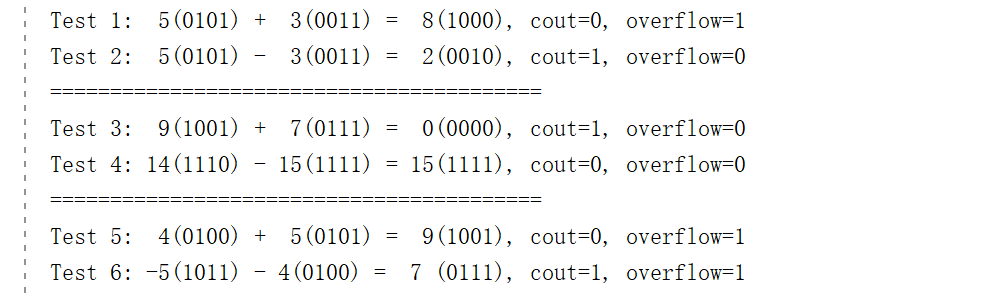
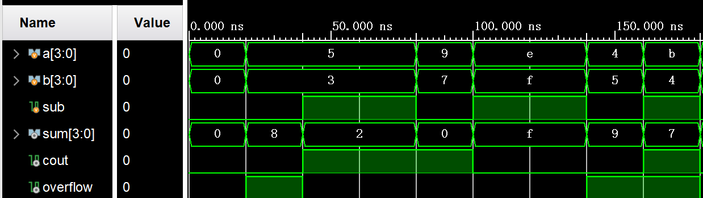

# 计算机组成原理实验报告

## 基本信息
- 实验名称：Lab1-1
- 姓名：陈一璟
- 学号：24300120183

## 一、实验目的
1. 掌握基于Verilog的4位加减法器设计方法
2. 理解2的补码原理及其在减法运算中的应用
3. 学习有符号数运算的溢出检测机制
4. 熟悉Vivado开发环境下的RTL设计、仿真与验证流程

## 二、实验原理

本实验基于数字电路中的加法器设计原理，实现一个4位加减运算单元（ALU的基础模块）。

1. **全加器原理**
   一位全加器用于实现三个输入（a、b、cin）的加法运算：
   - 和：`sum = a ⊕ b ⊕ cin`
   - 进位：`cout = (a & b) | ((a ^ b) & cin)`

2. **多位加法器（串行进位结构）**
   4位加法器由4个1位全加器级联组成，前一位的进位输出作为后一位的输入。

3. **补码与减法实现**
   减法通过补码实现：
   ```
   a - b = a + (~b + 1)
   ```
   并且对于运算单元，根据 `sub` 信号控制加减法：
   - 当 `sub = 1` 时，对 b 取反并加1
   - 当 `sub = 0` 时，执行正常加法

4. **溢出判定**
   对于n位有符号数（补码表示），其表示范围为`[-2^(n-1), 2^(n-1)-1]`。当运算结果超出此范围时发生溢出：
   - 正溢出：两个正数相加，结果符号位变为1
   - 负溢出：两个负数相加，结果符号位变为0
   - 检测方法：最高位（符号位）的进位输入和进位输出不同，说明符号位的运算结果与实际运算结果的符号不一致，发生溢出。

5. 有符号数和无符号数
   - 无符号数：所有位均表示数值，范围为`[0, 2^n-1]`
   - 有符号数（补码）：最高位为符号位，范围为`[-2^(n-1), 2^(n-1)-1]`
   - 同一二进制编码在不同解释体系下意义完全不同，设计时需明确数据类型和运算语义。


## 三、实验步骤

### 1. 实验准备
   - 安装Vivado 2020.2开发环境，导入实验项目文件
   - 了解Verilog HDL编程语言基础，掌握2的补码运算和溢出检测原理
   - 熟悉Vivado项目创建和仿真流程

### 2. 具体步骤
1. **理解`add_sub_4bit.v`和`adder_1bit.v`模块代码**
   - `add_sub_4bit.v`：4位加减法器模块，包含4个1位全加器级联，并添加加减法控制逻辑（通过`sub`信号控制，利用2的补码原理实现加减法）
   - `adder_1bit.v`：1位全加器模块，实现基本的1位加法功能

2. **添加溢出逻辑**
   - 在`add_sub_4bit.v`中添加溢出检测逻辑
   - 利用最高位的进位输入和输出判断溢出情况
   - 输出`overflow`信号，用于标志运算是否发生溢出
   
3. **编写测试用例**
   - 编写`test_add_sub.v`测试模块
   - 添加测试用例：`4’b1001 + 4’b0111`、`4’b1110 - 4’b1111`、`4+5`、`-5-4`

4. **仿真验证**
   - 在Vivado中创建项目并添加源文件
   - 运行RTL仿真
   - 分析仿真结果，验证功能正确性

### 3. 关键代码

1. 1位全加器模块：实现基本的1位加法功能
```verilog
// 1位全加器模块关键代码
   sum  = a ^ b ^ cin
   cout = (a & b) | ((a ^ b) & cin)
```

2. 4位加减法器模块：使用补码实现减法，添加溢出检测
```verilog
// 模块定义
module add_sub_4bit(
    // ......省略其他未修改的输入输出端口
    output overflow    // 溢出标志位
    );

    wire [3:0] b_comp;     // 补码处理后的 b
    // sub = 1 时，b 取反并 +1（通过 cin = sub = 1 实现）
    assign b_comp = sub ? ~b : b;  // 减法时取反
    wire [3:0] carry;   // 内部进位信号
    
    // 级联4个1位全加器
    adder_1bit fa0 (.a(a[0]), .b(b_comp[0]), .cin(sub), .sum(sum[0]), .cout(carry[0]));
    adder_1bit fa1 (.a(a[1]), .b(b_comp[1]), .cin(carry[0]), .sum(sum[1]), .cout(carry[1]));
    adder_1bit fa2 (.a(a[2]), .b(b_comp[2]), .cin(carry[1]), .sum(sum[2]), .cout(carry[2]));
    adder_1bit fa3 (.a(a[3]), .b(b_comp[3]), .cin(carry[2]), .sum(sum[3]), .cout(carry[3]));
    
    assign cout = carry[3];  // 最终进位输出

    // 添加溢出检测：对于有符号数，当最高位（符号位）的进位输入和进位输出不同时，发生溢出
    assign overflow = carry[3] ^ carry[2];
endmodule
```

```Verilog
// 测试文件中的实例化模块
// ......省略其他未修改的输入输出端口
   wire overflow;   // 添加溢出标志位
    
   add_sub_4bit uut (
      // ......省略其他未修改的输入输出端口
        .overflow(overflow)   // 添加溢出标志位
   );
// ......
```

3. 添加测试用例代码
```verilog
   // 在initial块中的部分，其余部分不变
    // 初始状态所有输入为0
    sub = 0;
    a = 4'b0000;
    b = 4'b0000;
    #20;
    
    // 测试1: 5+3
    sub = 0;
    a = 4'b0101;  // 5
    b = 4'b0011;  // 3
    #20;
    $display("Test 1: %d(%b) + %d(%b) = %d(%b), cout=%b, overflow=%b", a, a, b, b, sum, sum, cout, overflow);

    // 测试2: 5-3
    sub = 1;
    a = 4'b0101;  // 5
    b = 4'b0011;  // 3
    #20;
    $display("Test 2: %d(%b) - %d(%b) = %d(%b), cout=%b, overflow=%b", a, a, b, b, sum, sum, cout, overflow);

    
    #20;  // 分隔测试组
    $display("=========================================");

    // 测试3: 1001+0111
    sub = 0;    // 加法
    a = 4'b1001;
    b = 4'b0111;
    #20;
    $display("Test 3: %d(%b) + %d(%b) = %d(%b), cout=%b, overflow=%b", a, a, b, b, sum, sum, cout, overflow);

    
    // 测试4: 1110-1111
    sub = 1;
    a = 4'b1110;
    b = 4'b1111;
    #20;
    $display("Test 4: %d(%b) - %d(%b) = %d(%b), cout=%b, overflow=%b", a, a, b, b, sum, sum, cout, overflow);


    #20;  // 分隔测试组
    $display("=========================================");

    // 测试5：正溢出 (4+5)
    sub = 0;    // 加法
    a = 4'b0100;    // 4
    b = 4'b0101;    // 5
    #20;
    $display("Test 5: %d(%b) + %d(%b) = %d(%b), cout=%b, overflow=%b", a, a, b, b, sum, sum, cout, overflow);


    // 测试6：负溢出 (-5-4)
    sub = 1;    // 减法
    a = 4'b1011;    // -5
    b = 4'b0100;    // 4
    #20;
    $display("Test 6: -5(%b) - 4(%b) = %d (%b), cout=%b, overflow=%b", a, b, sum, sum, cout, overflow);
    
    // 最终状态所有输入为0
    sub = 0;
    a = 4'b0000;
    b = 4'b0000;
    #20;
```

## 四、实验结果
### 1. 实验现象
- 本实验总共设计6个测试用例，输出如下：



### 2. 波形分析（适用于Vivado仿真）

波形展示了每个测试用例的输入输出信号、进位和溢出标志位的变化。详细分析见结果分析部分。    



### 3. 结果分析
1. **Test 1**：`5 + 3`  

   - 无符号解释：8 在范围 [0,15] 内，结果正确
   - 有符号解释（补码）：1000 表示 -8（而不是 +8），实际应为 5 + 3 = 8，超出补码范围 [-8,7]
   - 结论：该结果在无符号下正确，但在有符号语义下发生溢出

2. **Test 2**：`5 - 3`  
   - 无符号解释：结果正确，5 - 3 = 2
   - 有符号解释：同样为 2，结果正确
   - 结论：在补码减法实现中，cout=1 表示无借位，对于有符号数来说，结果正确且不发生溢出

3. **Test 3**：`1001 + 0111`     
   - 无符号解释：实际应为 9 + 7 = 16，4位系统截断为 0000，产生进位 cout=1
   - 有符号解释（补码）：1001 = -7，运算实际为：-7 + 7 = 0
   - 结论：无符号下产生进位并发生截断；有符号补码运算中不同符号相加，不发生溢出，结果正确

4. **Test 4**：`1110 - 1111`     

   - 无符号解释：14 - 15 = -1（在4位无符号系统中结果截断为 1111，即15）
   - 有符号解释（补码）：1110 = -2，1111 = -1，运算实际为：-2 - (-1) = -1
   - 结论：在无符号数语义下结果截断为 1111，即15；在有符号补码语义下结果正确

5. **Test 5**：`4 + 5`（正溢出）    

   - 无符号解释：1001 = 9，结果正确
   - 有符号解释（补码）：1001 = -7，实际应为 4 + 5 = 9，超出范围 [-8,7]
   - 结论：overflow=1 正确反映了补码溢出，从正数溢出到负数

6. **Test 6**：`-5 - 4`（负溢出）      
   - 无符号解释：0111 = 7，但该结果不符合无符号减法语义
   - 有符号解释（补码）：0111 = 7，实际应为 -5 - 4 = -9，超出范围 [-8,7]
   - 结论：overflow=1 正确反映了补码溢出，从负数溢出到正数


## 五、实验思考
### 1. 遇到的问题及解决方法
1. 问题描述：溢出检测方式有多种，决定选择何种溢出检测方式最适合？    
   - 解决方法：选择了最高位（符号位）的进位输入和进位输出不同时，发生溢出的检测方式，这种检测方式简单直接，能够及时发现溢出情况。

2. 问题描述：Verilog测试用例中，格式化输出对于有符号/无符号数的规定不明确。      
   - 解决方法：同时打印二进制表示（b）和十进制表示（d），能够更清晰地展示有符号数和无符号数解读时的含义。

### 2. 实验心得

1. 学习了如何使用Verilog语言实现4位加减法器，理解了溢出的产生和检测机制。
2. 同一电路在有符号/无符号的解释下结果含义不同，这是数字系统设计中的关键语义问题。
3. 学习了如何使用Vivado进行仿真、查看波形以及其他实用操作，通过Vivado仿真验证了程序正确性。

## 六、实验评价
### 1. 自我评价

- 实验完成度：***□优秀*** □良好 □一般 □待提高
- 掌握程度：***□很好*** □较好 □一般 □需要加强

### 2. 实验反馈
1. 实验内容难度：□偏难 ***□适中*** □偏易
2. 实验时间安排：□充足 ***□适中*** □紧张
