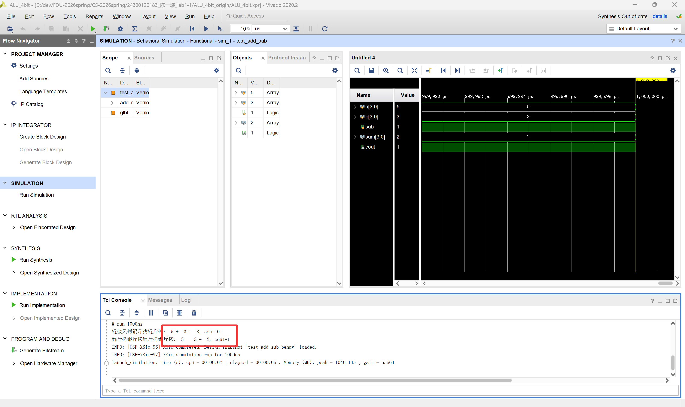
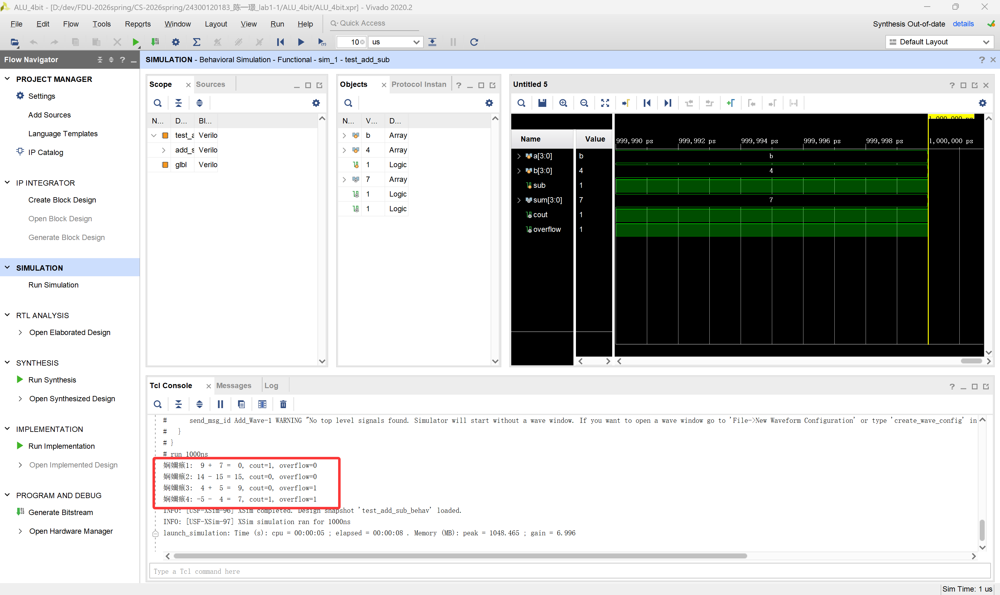

# 计算机组成原理实验报告

## 基本信息
- 实验名称：Lab1-1
- 姓名：陈一璟
- 学号：24300120183

## 一、实验目的
1. 掌握基于Verilog的4位加减法器设计方法
2. 理解2的补码原理及其在减法运算中的应用
3. 学习有符号数运算的溢出检测机制
4. 熟悉Vivado开发环境下的RTL设计、仿真与验证流程

## 二、实验原理

### 1. 4位加减法器设计
4位加减法器采用模块化设计，通过级联4个1位全加器实现：
- 加法运算：直接将两个4位输入A和B送入级联的全加器，进位输出连接到下一级的进位输入
- 减法运算：利用2的补码原理，`A - B = A + (-B)`，其中`-B`是`B`的补码（取反+1）
- 控制信号：通过`sub`控制加减运算，`sub = 0`时为加法，`sub = 1`时为减法

### 2. 溢出检测原理
对于n位有符号数，其表示范围为`[-2^(n-1), 2^(n-1)-1]`。当运算结果超出此范围时发生溢出：
- 正溢出：两个正数相加，结果符号位变为1
- 负溢出：两个负数相加，结果符号位变为0
- 检测方法：当最高位（符号位）的进位输入和进位输出不同时，发生溢出，即`overflow = carry[n-1] ^ carry[n]`

### 3. 相关知识点
- 全加器：实现1位二进制加法，包括进位输入和输出
- 2的补码：计算机中表示负数的常用方法，便于统一加减法运算
- 级联加法器：将多个全加器连接，实现多位数加法
- 溢出：有符号数运算结果超出表示范围的现象

## 三、实验步骤

### 1. 实验准备
- 安装Vivado开发环境
- 了解Verilog HDL编程语言基础
- 掌握2的补码运算和溢出检测原理
- 熟悉Vivado项目创建和仿真流程

### 2. 具体步骤
1. **理解`add_sub_4bit.v`和`adder_1bit.v`模块代码**
   - `add_sub_4bit.v`：4位加减法器模块，包含4个1位全加器级联，并添加加减法控制逻辑（通过`sub`信号控制）
   - `adder_1bit.v`：1位全加器模块，实现基本的1位加法功能

2. **添加溢出逻辑**
   - 在`add_sub_4bit.v`中添加溢出检测逻辑
   - 利用最高位的进位输入和输出判断溢出情况
   - 输出`overflow`信号，用于标志运算是否发生溢出
   
3. **编写测试用例**
   - 编写`test_add_sub.v`测试模块
   - 设计测试：`9+7`、`14-15`、`4+5`、`-5-4`
   - 注：测试中使用4位二进制有符号数表示

4. **仿真验证**
   - 在Vivado中创建项目并添加源文件
   - 运行RTL仿真
   - 分析仿真结果，验证功能正确性

### 3. 关键代码

#### 1. 1位全加器模块（无需修改）
```verilog
module adder_1bit(
    input a,      // 输入位 a
    input b,      // 输入位 b
    input cin,    // 进位输入
    output sum,   // 和输出
    output cout   // 进位输出
    );
    // 计算和：异或操作实现1位加法
    assign sum = a ^ b ^ cin;
    // 计算进位：当任意两个输入为1时产生进位
    assign cout = (a & b) | (a ^ b) & cin;
endmodule
```

#### 2. 4位加减法器模块与实例化（后续添加溢出检测）
```verilog
// 模块定义
module add_sub_4bit(
    input [3:0] a,      // 输入 a
    input [3:0] b,      // 输入 b
    input sub,         // 控制信号：0=加法，1=减法
    output [3:0] sum,   // 结果输出
    output cout,       // 进位/借位输出
    output overflow    // 溢出标志位
    );
    wire [3:0] b_comp;  // 补码处理后的 b
    // 补码逻辑：sub=1 时，b 取反并 +1（通过 cin=1 实现）
    assign b_comp = sub ? ~b : b;  // 减法时取反
    wire [3:0] carry;   // 内部进位信号
    
    // 级联4个1位全加器
    adder_1bit fa0 (.a(a[0]), .b(b_comp[0]), .cin(sub), .sum(sum[0]), .cout(carry[0]));
    adder_1bit fa1 (.a(a[1]), .b(b_comp[1]), .cin(carry[0]), .sum(sum[1]), .cout(carry[1]));
    adder_1bit fa2 (.a(a[2]), .b(b_comp[2]), .cin(carry[1]), .sum(sum[2]), .cout(carry[2]));
    adder_1bit fa3 (.a(a[3]), .b(b_comp[3]), .cin(carry[2]), .sum(sum[3]), .cout(carry[3]));
    
    assign cout = carry[3];  // 最终进位输出

    // 添加溢出检测：当最高位（符号位）的进位输入和进位输出不同时，发生溢出
    assign overflow = carry[3] ^ carry[2];
endmodule
```

```Verilog
// 测试文件中的实例化模块
// ......
   reg [3:0] a;
   reg [3:0] b;
   reg sub;
   wire [3:0] sum;
   wire cout;
   wire overflow;   // 添加溢出标志位
    
   add_sub_4bit uut (
        .a(a),
        .b(b),
        .sub(sub),
        .sum(sum),
        .cout(cout),
        .overflow(overflow)   // 添加溢出标志位
   );
// ......
```

#### 3. 测试用例代码（initial块中的部分）
```verilog
   // 在initial块中的部分，其余部分不变

   // 测试1: 9 + 7
   sub = 0;    // 加法
   a = 4'b1001;    // 9
   b = 4'b0111;    // 7
   #10;
   // 9+7=16，溢出
   $display("测试1: %d + %d = %d, cout=%b, overflow=%b", a, b, sum, cout, overflow);

   // 测试2: 14 - 15
   sub = 1;
   a = 4'b1110;  // 14
   b = 4'b1111;  // 15
   #10;
   // 14-15=-1，溢出
   $display("测试2: %d - %d = %d, cout=%b, overflow=%b", a, b, sum, cout, overflow);

   // 测试3: 4 + 5
   sub = 0;
   a = 4'b0100;  // 4
   b = 4'b0101;  // 5
   #10;
   // 4+5=9，无溢出
   $display("测试3: %d + %d = %d, cout=%b, overflow=%b", a, b, sum, cout, overflow);

   // 测试4: -5 - 4
   sub = 1;
   a = 4'b1011;  // -5 (补码表示)
   b = 4'b0100;  // 4
   #10;
   // -5-4=-9，无溢出
   $display("测试4: -5 - %d = %d, cout=%b, overflow=%b", b, sum, cout, overflow);
```

## 四、实验结果
### 1. 实验现象
1. 初始代码的测试用例为`5+3`和`5-3`，运行截图如下：
   


2. 添加溢出检测和相应测试用例后的运行截图如下：
   

### 2. 波形分析（适用于Vivado仿真）
（插入关键波形图并进行分析说明）
<!-- TODO：是否需要添加波形 -->

### 3. 结果分析
1. 初始代码运行
   - 由于5+3=8，无进位，则`cout = 0`；
   - 由于5-3=2，无借位，则`cout = 1`（补码减法中被减数大于减数）。

2. `4’b1001 + 4’b0111`与`4’b1110 - 4’b1111`
   - `4’b1001 + 4’b0111`，被视为无符号数9和7，而16超出四位二进制数范围被视为`b10000`，因此输出为`9+7=0`；
   - `4’b1110 - 4’b1111`，被视为无符号数14和15，而实际上执行`a+(~b+1)`，即`4’b1110 + (4’b0000 + 4’b0001) = 4'b1111`，因此输出为`14-15=15`。

3. 溢出测试`4 + 5`和`-5 - 4`
   - `4 + 5`使用有符号数的补码表示为`4'b0100 + 4'b0101 = 4'b1001`，得数相当于有符号数的-1，最高位为1，产生正溢出；
   - `-5 - 4`使用有符号数的补码表示为`4'b1011 + 4'b1100 = 4'b0111`，得数相当于有符号数的7，最高位为0，产生负溢出。

## 五、实验思考
### 1. 遇到的问题及解决方法
1. 问题描述：溢出检测方式有多种，决定选择何种溢出检测方式最适合？
   解决方法：
   - 选择了最高位（符号位）的进位输入和进位输出不同时，发生溢出的检测方式，这种检测方式简单直接，能够及时发现溢出情况。

2. 问题描述：
   解决方法：

### 2. 实验心得

1. 本次实验我学习了如何使用Verilog实现4位加减法器，理解了提供的源代码和测试用例。
2. 此外，我理解了溢出的产生和检测机制，能够根据溢出标志位判断计算结果是否正确。
3. 我还参考网络上的教程，学习了如何使用Vivado进行仿真、查看波形以及其他实用操作，通过Vivado仿真验证了程序正确性。

## 六、实验评价
### 1. 自我评价

- 实验完成度：***□优秀*** □良好 □一般 □待提高
- 掌握程度：***□很好*** □较好 □一般 □需要加强

### 2. 实验反馈
1. 实验内容难度：□偏难 ***□适中*** □偏易
3. 实验时间安排：□充足 ***□适中*** □紧张

### 3. 建议与改进（可选）
- 此前我使用Vivado的经验较少，建议助教老师在讲评时示范一下如何使用Vivado进行仿真、查看波形以及其他实用操作