# 计算机组成原理实验报告

## 基本信息
- 实验名称：Lab1-3
- 姓名：陈一璟
- 学号：24300120183

## 一、实验目的
1. 掌握半加器、全加器的电路实现
2. 理解补码运算原理
3. 构建4位加减法器
4. 实现4-1 MUX
5. 整合完整4位ALU

## 二、实验原理
本次实验主要涉及数字逻辑电路中的基本运算单元设计，包括以下核心原理：

1. **全加器**：全加器是实现二进制加法的基本电路，能够处理两个一位二进制数和一个进位输入的加法运算。其逻辑表达式为：
   - 本位和：Sum = A ⊕ B ⊕ Cin
   - 进位输出：Cout = A·B + (A ⊕ B)·Cin

2. **补码运算**：补码是一种用于表示有符号数的编码方式，通过对原码取反加1得到。补码的重要特性是可以将减法运算转化为加法运算，即 A - B = A + (~B+1)。

3. **减法器实现**：基于补码运算，减法器可以通过将减数取反后与被减数相加，并将借位输入取反后作为加法器的进位输入来实现。具体表达式为：A - B - Bin = A + (~B) + (1 - Bin)。

4. **多路选择器**：多路选择器是一种数据选择电路，根据选择信号从多个输入中选择一个输出。4选一多路选择器使用2位选择信号，通过两级2选1 MUX级联实现。

5. **ALU**：ALU是计算机中执行算术和逻辑运算的核心部件，本次实验实现的简单ALU包含加法、减法、与、或四种运算，通过多路选择器根据控制信号选择运算结果输出。


## 三、实验步骤
### 1. 一位加法器
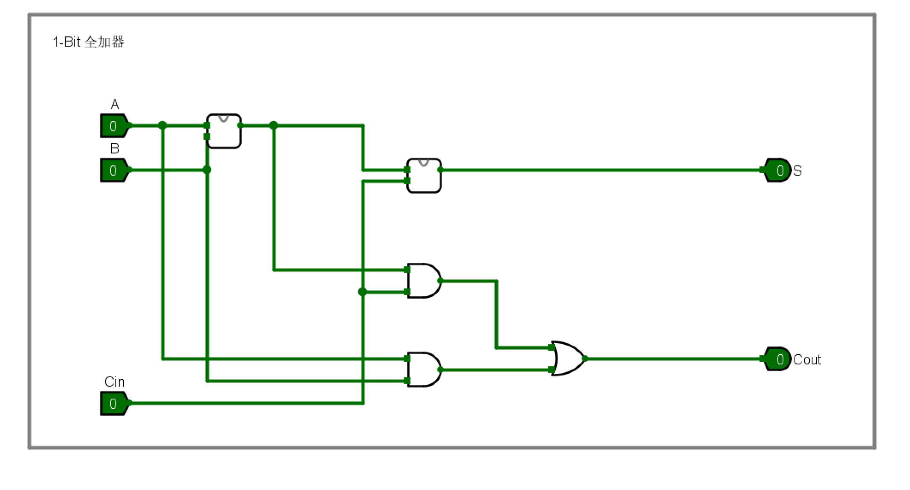
- 输入：A、B、Cin
- 输出：Sum、Cout
>
- 实现原理（直接按照表达式连接）：
```verilog
Sum = A ⊕ B ⊕ Cin
Cout =  A·B + (A ⊕ B)·Cin
```

### 2. 四位加法器

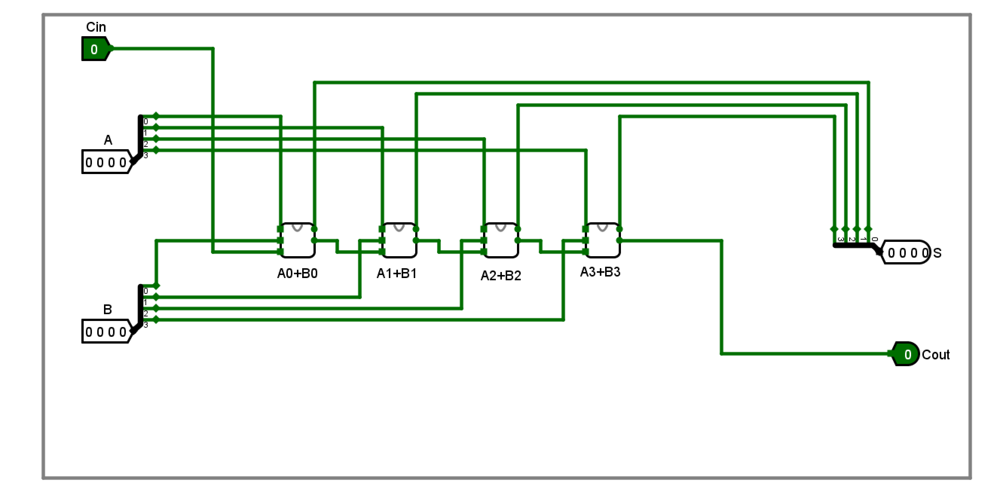
- 输入：A[3:0]、B[3:0]、Cin (恒为0)
- 输出：Sum[3:0], Cout
>
- 电路设置：每一个位的加法器输出Sum[i]，Cout[i]接到下一位的Cin[i+1]，Cout[3]为最终的进位输出
>
- 实现原理：
```verilog
Sum[i] = A[i] ⊕ B[i] ⊕ Cin[i]
Cout[i] = A[i]·B[i] + (A[i] ⊕ B[i])·Cin[i]
```

### 3. 补码
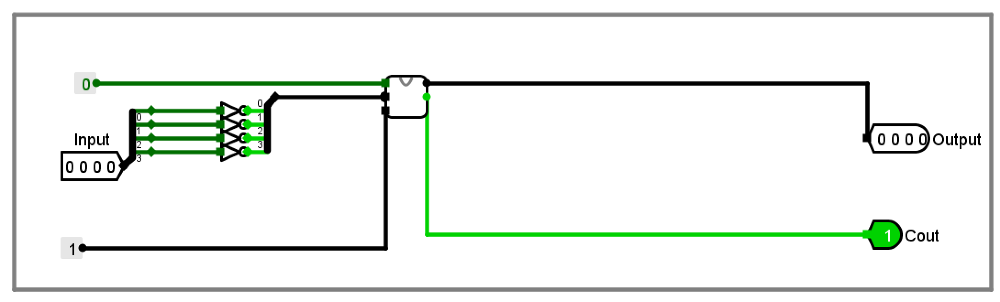
- 输入：Input[3:0]
- 输出：Output[3:0]、Cout
- 将Input[3:0]按位取反，再加1，得到Output[3:0]以及Cout
>
- **思考：如果对正数取反后加1？——得到该正数相反数的补码**

### 4. 四位减法器

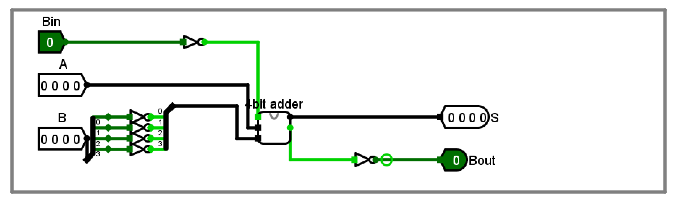

- 输入：A[3:0]、B[3:0]、Bin
- 输出：S[3:0]、Bout
>
- 实现原理：
```txt
A − B − Bin = A + (~B) + (1 − Bin)
```
  其中~B直接按位取反得到，Bin取反后可以得到1-Bin（不再使用“取反加一”的补码器）
>
- 电路设置：
  - B[3:0]按位取反得到 ~B[3:0]
  - Bin 取反连接到四位加法器的 Cin
  - 四位加法器输入为 A[3:0]、~B[3:0] 和 Cin
  - 四位加法器输出作为 S[3:0]
  - 四位加法器Cout 取反得到Bout


### 5. 四选一多路选择器
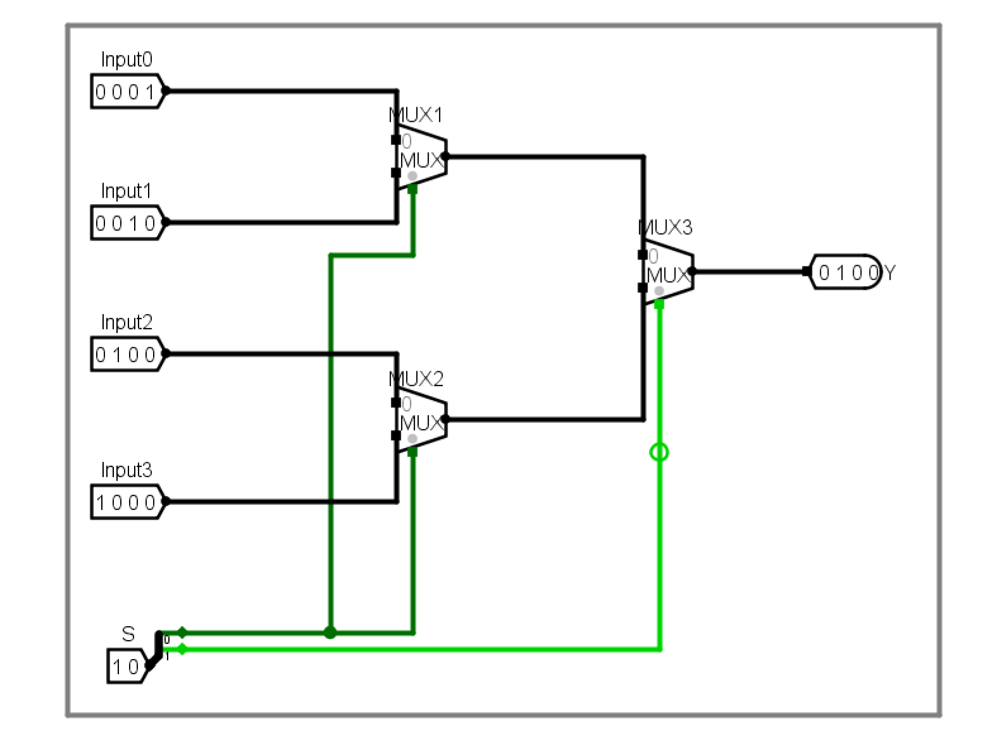
- 输入：Input[3:0]、S[1:0]
- 输出：Y[3:0]
>
- 实现原理：
  - 根据2位选择信号S[1:0]从4个4位输入中选择一个输出
  - S=00选择Input[0]，S=01选择Input[1]，S=10选择Input[2]，S=11选择Input[3]（图中为选择S=10）
>
- 电路设置：使用2选1 MUX级联
  - 第一级：2个2选1 MUX，S0选择：
    - MUX1：选择Input0、Input1（S0=0 选 Input0，S0=1 选 Input1）
    - MUX2：选择Input2、Input3（S0=0 选 Input2，S0=1 选 Input3）
  - 第二级：1个2选1 MUX，S1选择：
    - MUX3：选择MUX1和MUX2的输出（S1=0 选MUX1的输出，S1=1 选MUX2的输出）

### 6. 简单ALU
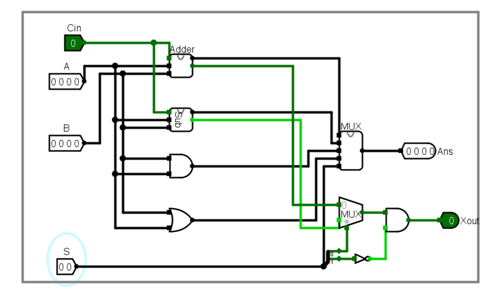

- 输入：A[3:0]、B[3:0]、Cin、S[1:0]
- 输出：Ans[3:0]、Xout（只有加法和减法运算有意义）
>
- 实现原理：

  - 使用4选一多路选择器根据选择信号S[1:0]在四种运算结果中选择输出，Xout单独处理
>
- 电路设置：

  - 运算模块结果通过4选一多路选择器选择，输出Ans[3:0]：

    - 4 位加法器：输入 A、B、Cin，输出 Sum[3:0] 和 Cout
    - 4 位减法器：输入 A、B，输出 Diff[3:0] 和 Bout
    - 4 位与门：输入 A、B，输出 And[3:0]
    - 4 位或门：输入 A、B，输出 Or[3:0]

  - 1个2选1 MUX和一个与门，输出Xout：
    - 根据S0选择：
      - 输入0：加法器 Cout
      - 输入1：减法器 Bout
    - 结果与S1的非门输出相与，S1=0时输出进位/借位，S1=1时输出0（与/或运算时Xout无意义）

## 四、实验结果
### Test 1

A=1111 B=1100 Xin=1 S=00，预期结果为Ans=1100 Xout=1 (加法)
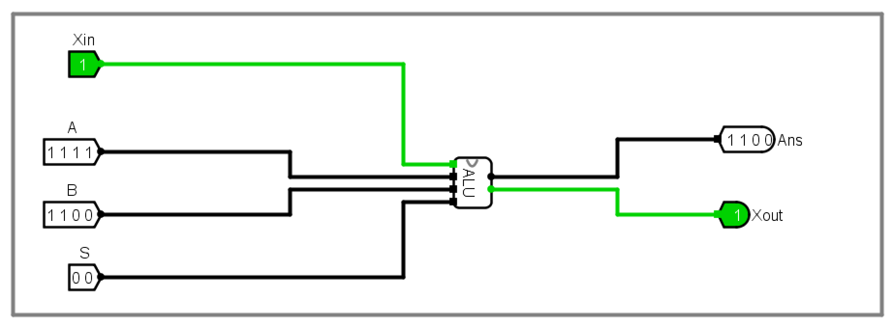

### Test 2

A=1111 B=1100 Xin=1 S=01，预期结果为Ans=0010 Xout=0 (减法)
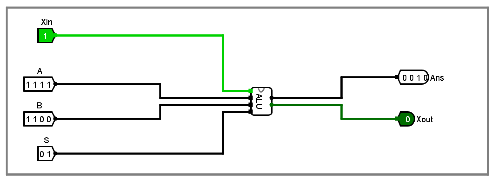

### Test 3

A=0011 B=0111 Xin=0 S=01，预期结果为Ans=1100 Xout=1  (减法)
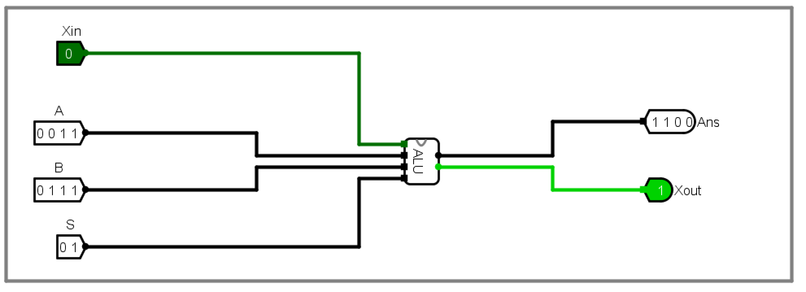

### Test 4

A=1010 B=1100 Xin=0 S=10，预期结果为Ans=1000 Xout=0
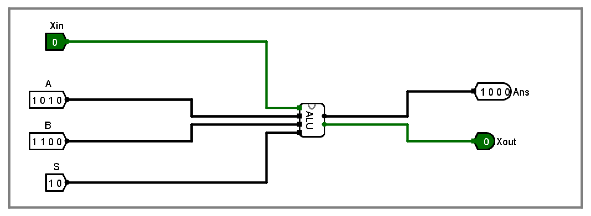

### Test 5

A=0000 B=0000 Xin=0 S=01，预期结果为Ans=0000 Xout=0

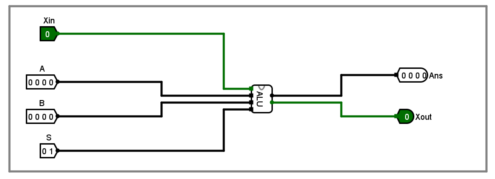

### Test 6

A=0000 B=0001 Xin=0 S=01，预期结果为Ans=1111 Xout=1 (0减1)

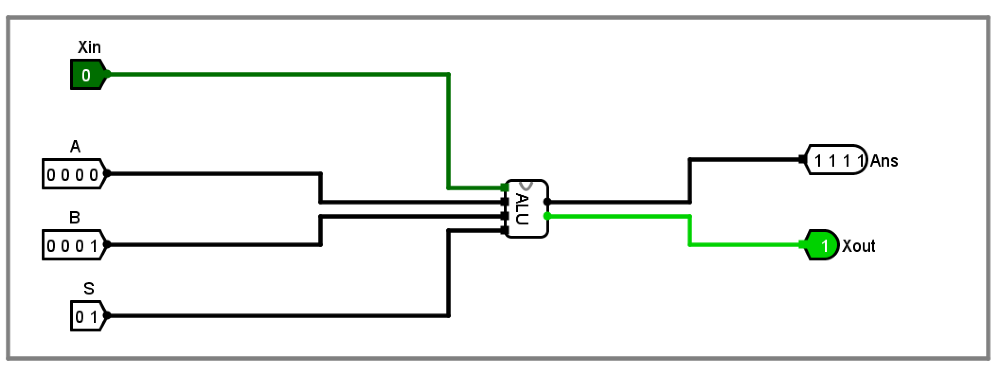

### Test 7

A=1111 B=1111 Xin=1 S=00，预期结果为Ans=1111 Xout=1 (最大值加法)

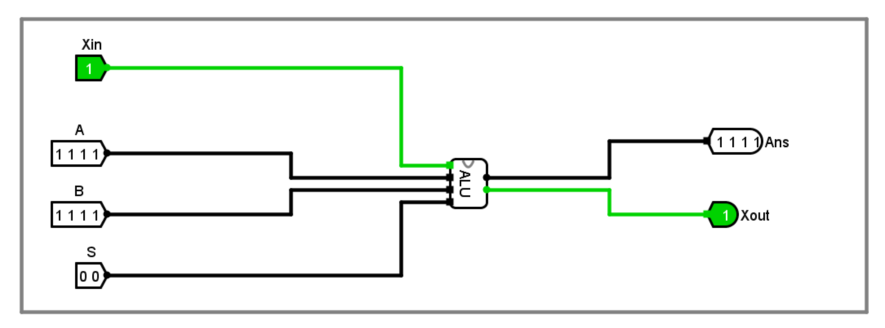

## 五、实验思考
### 1. 遇到的问题及解决方法
1. 问题描述：四位减法器同时使用补码器（取反加一）和借位输入 Bin，导致重复加1引起减法结果错误。
   解决方法：减法器改为对 B 仅按位取反并将Bin取反后接入加法器Cin，避免重复加1。

2. 问题描述：主电路中出现未知值X，无法模拟。
   解决方法：通过复位电路并重新启用仿真（Reset后再次Enable）清除未定义状态并成功模拟，但是没有找到产生未知值X的原因。

### 2. 实验心得

1. **Logisim软件的使用**：掌握了Logisim软件的基本操作，包括电路的设计、实现、仿真和调试。学会了如何使用各种逻辑门、如何搭建复杂电路、如何设置输入输出引脚以及如何进行电路仿真测试。

2. **数字逻辑电路的设计与实现**：
   - 深入理解了全加器的工作原理，掌握了一位全加器和四位全加器的设计方法
   - 理解了补码运算的原理，学会了补码器的设计与实现
   - 掌握了基于补码的减法器实现方法，理解了如何将减法运算转化为加法运算
   - 学会了四选一多路选择器的设计，掌握了通过级联实现复杂选择逻辑的方法
   - 成功设计并实现了包含加法、减法、与、或四种运算的简单ALU

3. **模块化设计思想**：实验采用了模块化的设计方法，将复杂的ALU分解为全加器、减法器、多路选择器等基本单元。

## 六、实验评价
### 1. 自我评价

- 实验完成度：***□优秀*** □良好 □一般 □待提高
- 掌握程度：***□很好*** □较好 □一般 □需要加强

### 2. 实验反馈
1. 实验内容难度：***□偏难*** □适中 □偏易
2. 实验时间安排：□充足 ***□适中*** □紧张