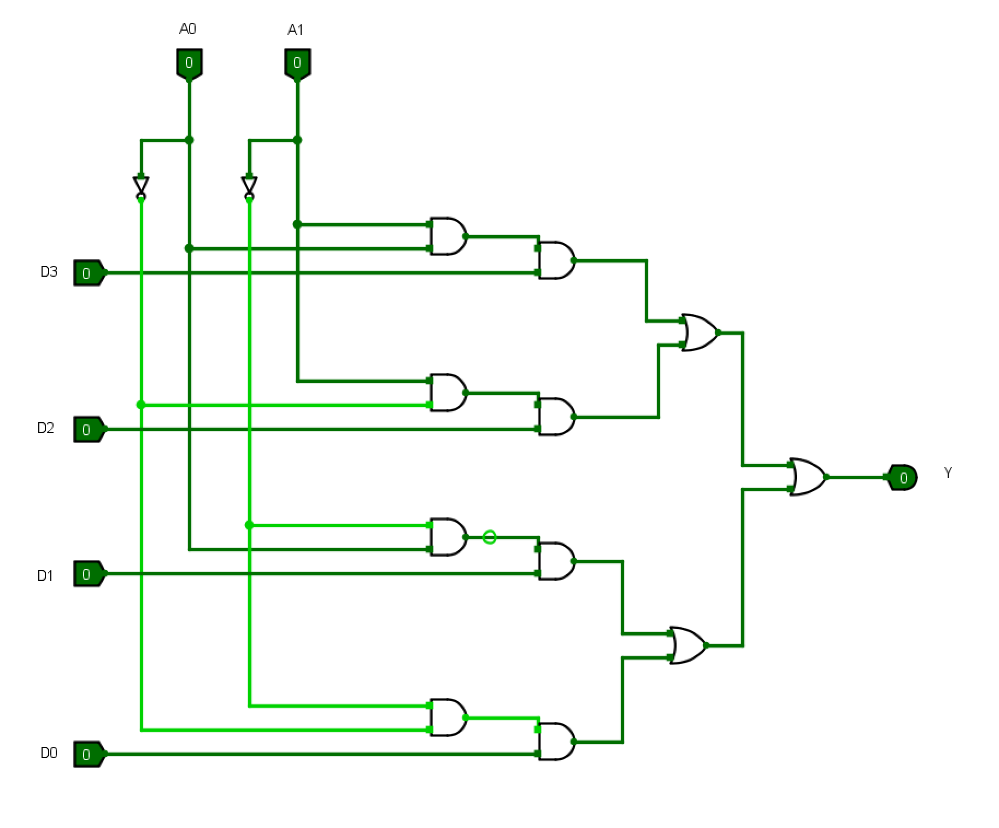

# 计算机组成原理实验报告

## 基本信息
- 实验名称：Lab1-3
- 姓名：陈一璟
- 学号：24300120183

## 一、实验目的
1. 掌握半加器、全加器的电路实现
2. 理解补码运算原理
3. 构建4位加减法器
4. 实现MUX多路选择器
5. 整合完整4位ALU

## 二、实验原理
（简要说明本次实验的基本原理和相关知识点，包括全加器、补码和减法器等）
**1. 全加器**：

- 全加器在半加器（实现一位二进制数相加的基本单元）的基础上增加了进位输入（Cin），用于实现多位加法运算。具有三个输入（A、B、Cin）和两个输出（Sum、Carry）。

- 真值表：


- 逻辑表达式：
```verilog
Sum = A ⊕ B ⊕ Cin
Carry =  A·B + (A ⊕ B)·Cin
```

**2. 补码设计**：

- 补码是一种用于表示有符号二进制数的方法，其中最高位（符号位）表示符号，其他位表示绝对值。
- 补码的计算方法：
  - 正数的补码与原码相同
  - 负数的补码为其原码的反码（除符号位外按位取反）加1
<!-- TODO： 补码的减法运算原理 -->

**3. 减法器**：

## 三、实验步骤
### 1. 一位加法器

- 输入：A、B、Cin
- 输出：Sum、Carry
- 逻辑表达式：
```verilog
Sum = A ⊕ B ⊕ Cin
Carry =  A·B + (A ⊕ B)·Cin
```

### 2. 四位加法器
（插入Logisim的电路截图和说明）
<!-- TODO: 4位全加器电路图 -->

- 输入：A[3:0]、B[3:0]、Cin[3:0]
- 输出：Sum[3:0], Cout[3:0]，其中Cout[3]为最终的进位输出
- 逻辑表达式：
```verilog
Sum[i] = A[i] ⊕ B[i] ⊕ Cin[i]
Cout[i] = A[i]·B[i] + (A[i] ⊕ B[i])·Cin[i]
```
- 最后可以根据Cout[3]判断是否溢出

### 3. 补码

- 输入：B[3:0]、Control
- 输出：Out[3:0]
- 逻辑表达式：
```verilog
// 当Control=1时，输出补码；当Control=0时，输出原值
Out[i] = Control'·B[i] + Control·(~B[i] + 1)
```
- 实现原理：
  - 补码转换：对原码按位取反后加1
  - 正数补码与原码相同，负数补码 = 反码 + 1
  - 用于减法运算：A - B = A + (-B) = A + (~B + 1)

### 4. 四位减法器

- 输入：A[3:0]、B[3:0]、Bin
- 输出：Diff[3:0]、Bout
- 逻辑表达式：
```verilog
Diff[i] = A[i] ⊕ B[i] ⊕ Bin[i]
Bout[i] = A[i]'·B[i] + (A[i] ⊕ B[i])'·Bin[i]
```
- 实现原理：利用补码将减法转换为加法，A - B = A + (~B + 1)
- 最后可以根据Bout[3]判断是否需要借位

### 5. 四选一多路选择器

- 选择端：A[1:0]
- 输入端：D[3:0]
- 输出：Y，根据选择端A[1:0]选择D[3:0]中的一个输出
- 逻辑表达式：
```verilog
// 00选D[0]，01选D[1]，10选D[2]，11选D[3]
Y = (A[1]'·A[0]'·D[0]) + (A[1]'·A[0]·D[1]) + (A[1]·A[0]'·D[2]) + (A[1]·A[0]·D[3])
```

（插入Logisim的电路截图和说明）

### 6. 简单ALU

（插入Logisim的电路截图和说明）

## 四、实验结果
### Test 1

A=1111 B=1100 Xin=1 S=00，预期结果为Ans=1100 Xout=1 (加法)

（截图即可，无需说明）

### Test 2

A=1111 B=1100 Xin=1 S=01，预期结果为Ans=0010 Xout=0 (减法)

（截图即可，无需说明）

### Test 3

A=0011 B=0111 Xin=0 S=01，预期结果为Ans=1100 Xout=1  (减法)

（截图即可，无需说明）

### Test 4

A=1010 B=1100 Xin=0 S=10，预期结果为Ans=1000 Xout=0

（截图即可，无需说明）

### Test 5

A=0000 B=0000 Xin=0 S=01，预期结果为Ans=0000 Xout=0

（截图即可，无需说明）

### Test 6

A=0000 B=0001 Xin=0 S=01，预期结果为Ans=1111 Xout=1 (0减1)

（截图即可，无需说明）

### Test 7

A=1111 B=1111 Xin=1 S=00，预期结果为Ans=1111 Xout=1 (最大值加法)

（截图即可，无需说明）

## 五、实验思考
### 1. 遇到的问题及解决方法
1. 问题描述：
   解决方法：

2. 问题描述：
   解决方法：

### 2. 实验心得
（描述通过本次实验学到的知识和技能）
1. Logisim软件的使用


## 六、实验评价
### 1. 自我评价

> 将选择的项加粗加斜即可
>
> 例如：□***优秀*** □良好 □一般 □待提高

- 实验完成度：□优秀 □良好 □一般 □待提高
- 掌握程度：□很好 □较好 □一般 □需要加强

### 2. 实验反馈
1. 实验内容难度：□偏难 □适中 □偏易
3. 实验时间安排：□充足 □适中 □紧张

### 3. 建议与改进（可选）
> 对实验内容等方面的建议