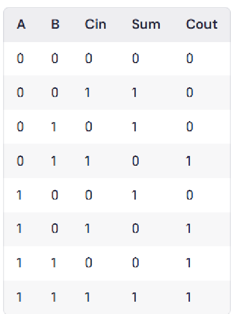
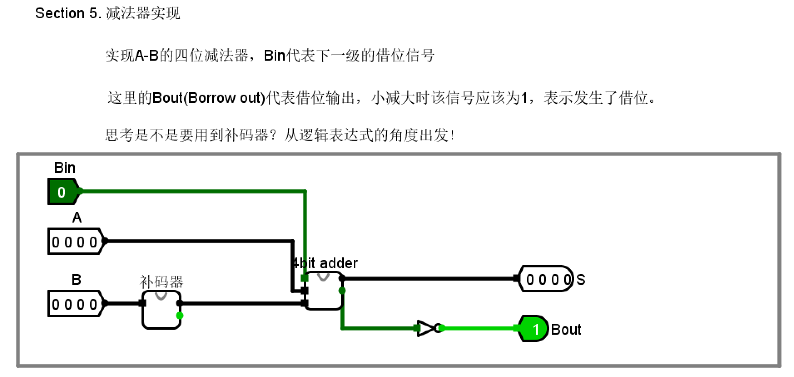

# 计算机组成原理实验报告

## 基本信息
- 实验名称：Lab1-3
- 姓名：陈一璟
- 学号：24300120183

## 一、实验目的
1. 掌握半加器、全加器的电路实现
2. 理解补码运算原理
3. 构建4位加减法器
4. 实现MUX多路选择器
5. 整合完整4位ALU

## 二、实验原理
（简要说明本次实验的基本原理和相关知识点，包括全加器、补码和减法器等）
**1. 全加器**：

- 全加器在半加器（实现一位二进制数相加的基本单元）的基础上增加了进位输入（Cin），用于实现多位加法运算。具有三个输入（A、B、Cin）和两个输出（Sum、Carry）。

- 真值表：


- 逻辑表达式：
```verilog
Sum = A ⊕ B ⊕ Cin
Carry =  A·B + (A ⊕ B)·Cin
```

**2. 补码设计**：

- 补码是一种用于表示有符号二进制数的方法，其中最高位（符号位）表示符号，其他位表示绝对值。
- 补码的计算方法：
  - 正数的补码与原码相同
  - 负数的补码为其原码的反码（除符号位外按位取反）加1
<!-- TODO： 补码的减法运算原理 -->

**3. 减法器**：

## 三、实验步骤
### 1. 一位加法器

- 输入：A、B、Cin
- 输出：Sum、Cout
- 逻辑表达式：
```verilog
Sum = A ⊕ B ⊕ Cin
Cout =  A·B + (A ⊕ B)·Cin
```

### 2. 四位加法器
（插入Logisim的电路截图和说明）

- 输入：A[3:0]、B[3:0]、Cin (恒为0)
- 输出：Sum[3:0], Cout
- 每一个位的加法器输出Sum[i]，Cout[i]接到下一位的Cin[i+1]，Cout[3]为最终的进位输出
- 逻辑表达式：
```verilog
Sum[i] = A[i] ⊕ B[i] ⊕ Cin[i]
Cout[i] = A[i]·B[i] + (A[i] ⊕ B[i])·Cin[i]
```

### 3. 补码

- 输入：Input[3:0]
- 输出：Output[3:0]、Cout
- 将Input[3:0]按位取反，再加1，得到Output[3:0]以及Cout

- **思考：如果对正数取反后加1？——得到该正数相反数的补码**

### 4. 四位减法器

- 输入：A[3:0]、B[3:0]、Bin
- 输出：S[3:0]、Bout

- 实现原理：
  - 利用补码将减法转换为加法，A - B = A + (~B + 1)，实际通过补码器实现对B取反加一
  - 再通过四位全加器，将A和~B+1相加，S[3:0]为A-B的差
  - 全加器的Cout取反得到Bout，当小减大时Bout为1

### 5. 四选一多路选择器

- 输入：Input[3:0][3:0]、S[1:0]
- 输出：Y[3:0]
- 逻辑表达式：
```verilog
// S=00选Input[0]，S=01选Input[1]，S=10选Input[2]，S=11选Input[3]
Y[i] = (S[1]'·S[0]'·Input[0][i]) + (S[1]'·S[0]·Input[1][i]) +
       (S[1]·S[0]'·Input[2][i]) + (S[1]·S[0]·Input[3][i])
```
- 实现原理：
  - 根据2位选择信号S[1:0]从4个4位输入中选择一个输出
  - 使用解码器生成4个选择信号，每个选择信号控制对应输入的传输
  - S=00选择Input[0]，S=01选择Input[1]，S=10选择Input[2]，S=11选择Input[3]
- 电路设置：
  - 解码器部分：使用2个NOT门和4个AND门生成选择信号
    - Sel0 = S[1]'·S[0]'（选择Input[0]）
    - Sel1 = S[1]'·S[0]（选择Input[1]）
    - Sel2 = S[1]·S[0]'（选择Input[2]）
    - Sel3 = S[1]·S[0]（选择Input[3]）
  - 选择部分：对每一位使用4个AND门和1个OR门
    - AND门：Input[j][i] AND Selj
    - OR门：将4个AND门的输出合并为Y[i]
    <!-- TODO：上回写到这了 -->

### 6. 简单ALU

（插入Logisim的电路截图和说明）

## 四、实验结果
### Test 1

A=1111 B=1100 Xin=1 S=00，预期结果为Ans=1100 Xout=1 (加法)

（截图即可，无需说明）

### Test 2

A=1111 B=1100 Xin=1 S=01，预期结果为Ans=0010 Xout=0 (减法)

（截图即可，无需说明）

### Test 3

A=0011 B=0111 Xin=0 S=01，预期结果为Ans=1100 Xout=1  (减法)

（截图即可，无需说明）

### Test 4

A=1010 B=1100 Xin=0 S=10，预期结果为Ans=1000 Xout=0

（截图即可，无需说明）

### Test 5

A=0000 B=0000 Xin=0 S=01，预期结果为Ans=0000 Xout=0

（截图即可，无需说明）

### Test 6

A=0000 B=0001 Xin=0 S=01，预期结果为Ans=1111 Xout=1 (0减1)

（截图即可，无需说明）

### Test 7

A=1111 B=1111 Xin=1 S=00，预期结果为Ans=1111 Xout=1 (最大值加法)

（截图即可，无需说明）

## 五、实验思考
### 1. 遇到的问题及解决方法
1. 问题描述：
   解决方法：

2. 问题描述：
   解决方法：

### 2. 实验心得
（描述通过本次实验学到的知识和技能）
1. Logisim软件的使用


## 六、实验评价
### 1. 自我评价

> 将选择的项加粗加斜即可
>
> 例如：□***优秀*** □良好 □一般 □待提高

- 实验完成度：□优秀 □良好 □一般 □待提高
- 掌握程度：□很好 □较好 □一般 □需要加强

### 2. 实验反馈
1. 实验内容难度：□偏难 □适中 □偏易
3. 实验时间安排：□充足 □适中 □紧张

### 3. 建议与改进（可选）
> 对实验内容等方面的建议