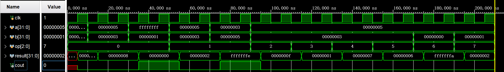

# 计算机组成原理实验报告

## 基本信息
- 实验名称：Lab1-4
- 姓名：陈一璟
- 学号：24300120183

## 一、实验目的
- 设计并实现一个32位序列ALU
- 实现8种基本运算功能：加法、减法、乘法、与、或、异或、非、右移
- 掌握Verilog HDL语言的基本语法和设计方法
- 学习使用测试文件验证电路功能

## 二、实验内容
1. 设计ALU_Seq模块，实现8种运算功能
2. 编写测试文件ALU_Seq_tb.v，验证10个测试用例
3. 运行仿真并分析结果

## 三、实验要求
1. 严格按照给定的端口定义设计ALU_Seq模块
2. 实现8种基本运算功能
3. 确保在时钟上升沿完成运算操作
4. 正确处理进位/溢出标志
5. 编写完整的测试文件，验证所有运算功能

## 四、实验结果

### 1. 模块代码
```verilog
// ALU_Seq.v
// 模块名称：ALU_Seq
// 功能：实现8种基本运算，在时钟上升沿完成操作
// 输入端口：clk（时钟，上升沿触发）、a（32位操作数A）、b（32位操作数B）、op（3位操作码）
// 输出端口：result（32位运算结果）、cout（进位/溢出标志）

module ALU_Seq(
    input wire clk,
    input wire [31:0] a,
    input wire [31:0] b,
    input wire [2:0] op,
    output reg [31:0] result,
    output reg cout
);

    always @(posedge clk) begin
        case(op)
            3'b000: // 加法
                begin
                    {cout, result} = a + b;
                end
            3'b001: // 减法
                begin
                    {cout, result} = a - b;
                end
            3'b010: // 乘法
                begin
                    result = a * b;
                    cout = 0;
                end
            3'b011: // 与运算
                begin
                    result = a & b;
                    cout = 0;
                end
            3'b100: // 或运算
                begin
                    result = a | b;
                    cout = 0;
                end
            3'b101: // 异或运算
                begin
                    result = a ^ b;
                    cout = 0;
                end
            3'b110: // 非运算
                begin
                    result = ~a;
                    cout = 0;
                end
            3'b111: // 右移运算
                begin
                    result = a >> b;
                    cout = 0;
                end
        endcase
    end

endmodule
```

### 2. 测试代码
```verilog
// ALU_Seq_tb.v
// 测试文件：用于验证ALU_Seq模块的功能
// 测试用例：10个指定的测试

`timescale 1ns / 1ps

module ALU_Seq_tb;

    // 输入信号
    reg clk;
    reg [31:0] a;
    reg [31:0] b;
    reg [2:0] op;
    
    // 输出信号
    wire [31:0] result;
    wire cout;
    
    // 实例化ALU_Seq模块
    ALU_Seq uut (
        .clk(clk),
        .a(a),
        .b(b),
        .op(op),
        .result(result),
        .cout(cout)
    );
    
    // 时钟信号生成
    initial begin
        clk = 0;
        forever #5 clk = ~clk;
    end
    
    // 测试用例
    initial begin
        // 测试用例1: 5 + 3 = 8，cout=0
        #10 a = 5; b = 3; op = 3'b000;
        #10 $display("Test 1: 5 + 3 = %d, cout = %d", result, cout);
        
        // 测试用例2: FFFFFFFF + 1 = 0，cout=1
        #10 a = 32'hFFFFFFFF; b = 1; op = 3'b000;
        #10 $display("Test 2: FFFFFFFF + 1 = %h, cout = %d", result, cout);
        
        // 测试用例3: 5 - 3 = 2，cout=0
        #10 a = 5; b = 3; op = 3'b001;
        #10 $display("Test 3: 5 - 3 = %d, cout = %d", result, cout);
        
        // 测试用例4: 3 - 5 = FFFFFFFE，cout=1
        #10 a = 3; b = 5; op = 3'b001;
        #10 $display("Test 4: 3 - 5 = %h, cout = %d", result, cout);
        
        // 测试用例5: 5 * 3 = 15，cout=0
        #10 a = 5; b = 3; op = 3'b010;
        #10 $display("Test 5: 5 * 3 = %d, cout = %d", result, cout);
        
        // 测试用例6: 5 & 3 = 1，cout=0
        #10 a = 5; b = 3; op = 3'b011;
        #10 $display("Test 6: 5 & 3 = %d, cout = %d", result, cout);
        
        // 测试用例7: 5 | 3 = 7，cout=0
        #10 a = 5; b = 3; op = 3'b100;
        #10 $display("Test 7: 5 | 3 = %d, cout = %d", result, cout);
        
        // 测试用例8: 5 ^ 3 = 6，cout=0
        #10 a = 5; b = 3; op = 3'b101;
        #10 $display("Test 8: 5 ^ 3 = %d, cout = %d", result, cout);
        
        // 测试用例9: ~5 = FFFFFFFA，cout=0
        #10 a = 5; b = 0; op = 3'b110;
        #10 $display("Test 9: ~5 = %h, cout = %d", result, cout);
        
        // 测试用例10: 5 >> 1 = 2，cout=0
        #10 a = 5; b = 1; op = 3'b111;
        #10 $display("Test 10: 5 >> 1 = %d, cout = %d", result, cout);
        
        // 结束仿真
        #10 $finish;
    end

endmodule
```

### 3. 仿真波形图
（仿真波形图）



## 五、实验思考
### 1. 遇到的问题及解决方法
1. 问题描述：
   解决方法：

2. 问题描述：
   解决方法：

### 2. 实验心得
（描述通过本次实验学到的知识和技能）


## 六、实验评价
### 1. 自我评价

> 将选择的项加粗加斜即可
>
> 例如：□***优秀*** □良好 □一般 □待提高

- 实验完成度：***□优秀*** □良好 □一般 □待提高
- 掌握程度：***□很好*** □较好 □一般 □需要加强

### 2. 实验反馈
1. 实验内容难度：□偏难 ***□适中*** □偏易
3. 实验时间安排：□充足 ***□适中*** □紧张

### 3. 建议与改进（可选）
> 对实验内容等方面的建议