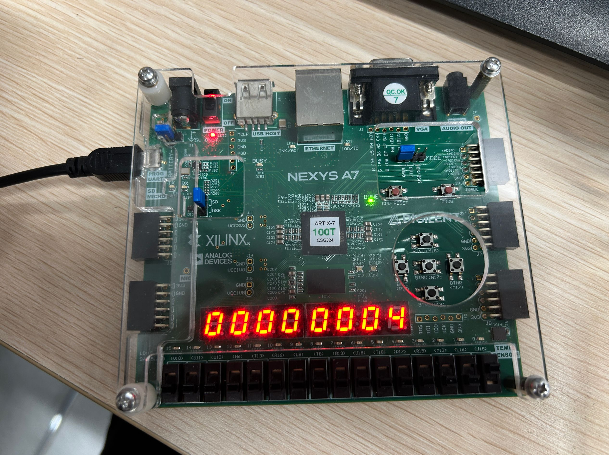
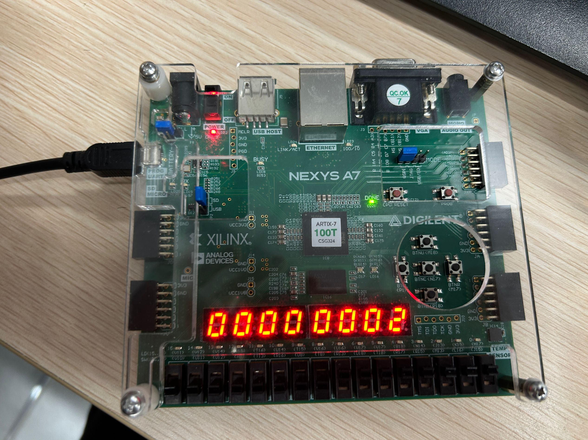
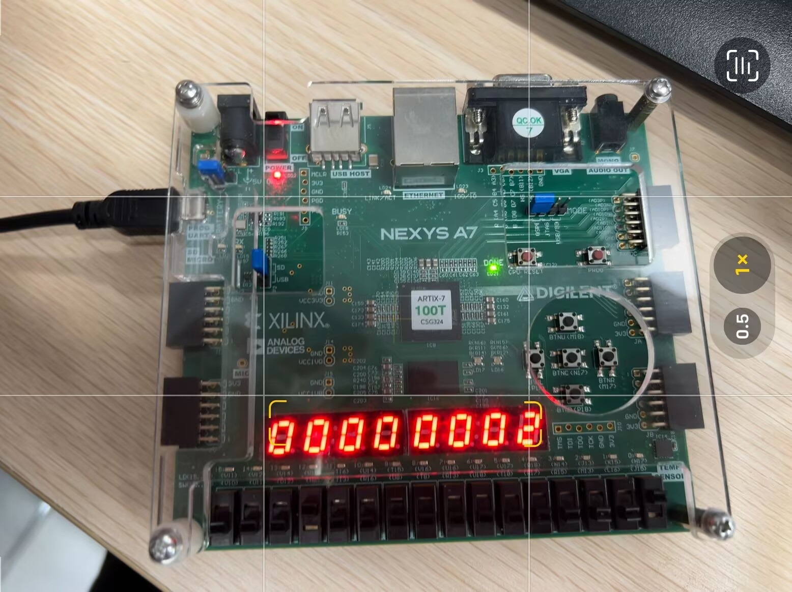
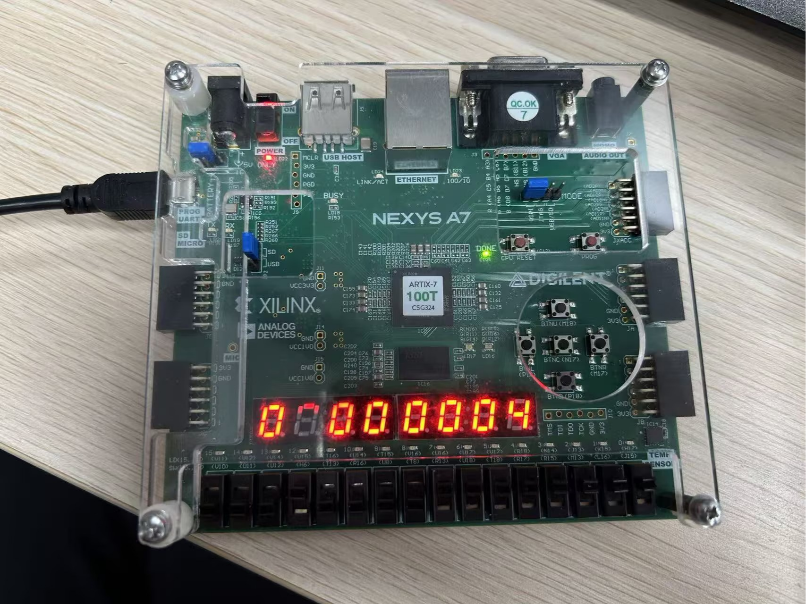
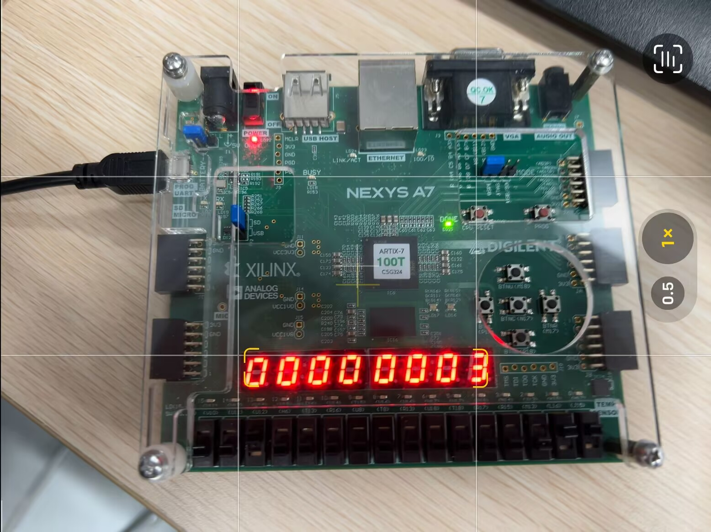
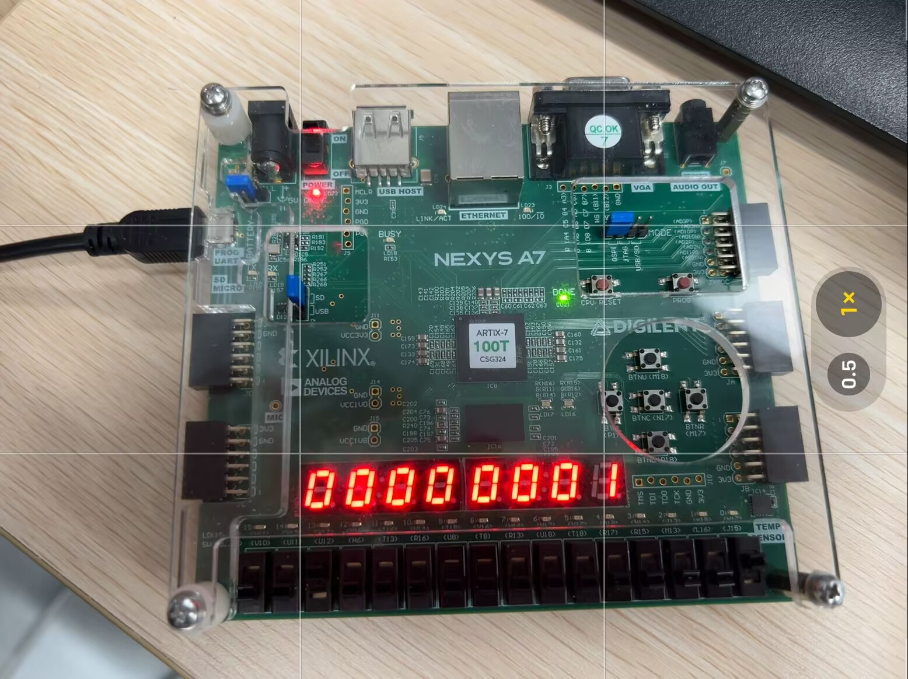
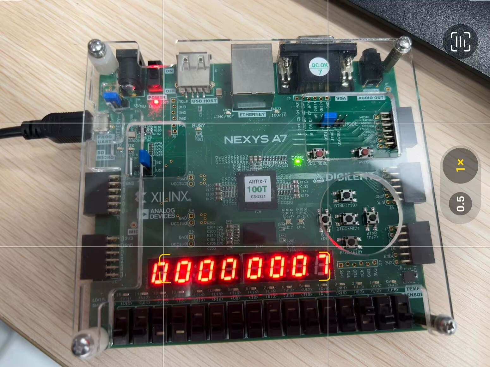
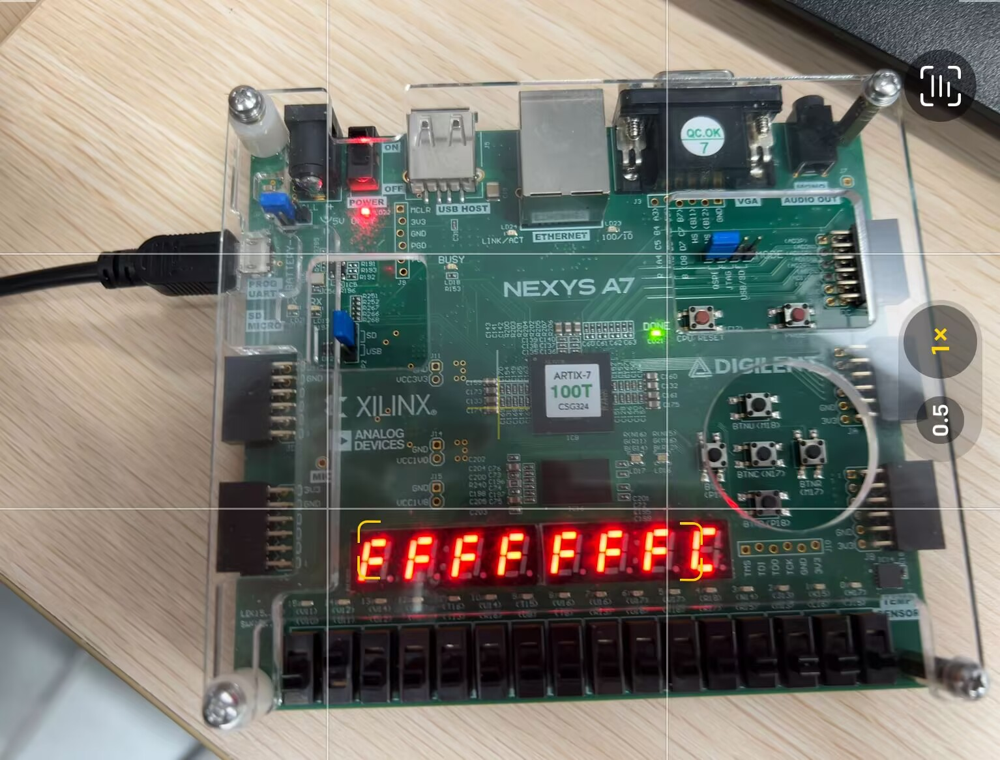
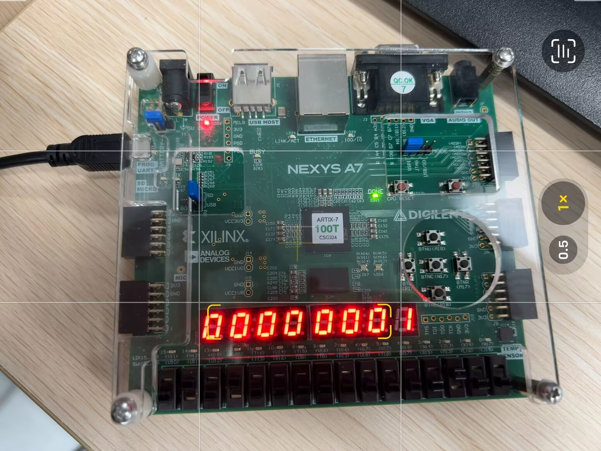
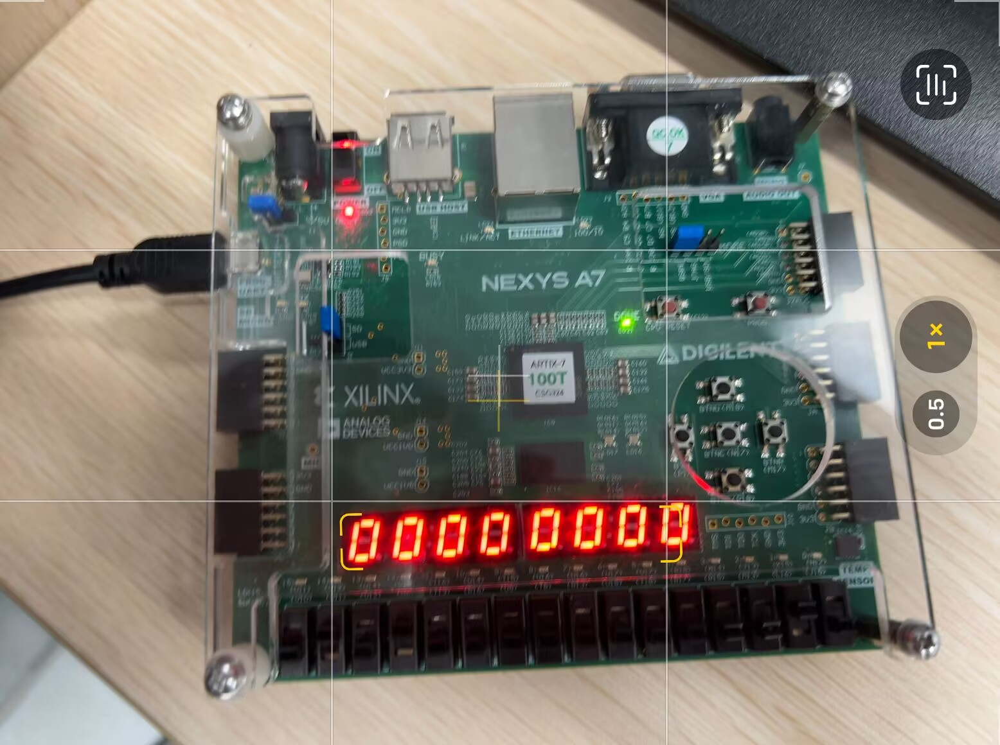

# 计算机组成原理实验报告

## 基本信息
- 实验名称：Lab1-5
- 姓名：陈一璟
- 学号：24300120183

## 一、实验目标
在FPGA实验板上实现ALU：
- 设计并实现一个支持6种基本运算的ALU模块
- 实现通过七段数码管显示32位运算结果的逻辑
- 验证ALU在FPGA实验板上的实际运行效果
- 掌握Verilog HDL编程和FPGA开发流程

## 二、实验任务
1. 设计并实现ALU核心模块（calculate.v），支持加、减、与、或、取反、比较大小6种运算
2. 设计并实现七段数码管显示模块（seg7.v），将4位二进制数据转换为七段数码管显示格式
3. 设计并实现显示控制模块（display.v），包括时钟分频和8位数码管扫描控制
4. 设计并实现顶层模块（top.v），连接各个子模块形成完整系统
5. 编写约束文件，将输入输出信号映射到FPGA实验板的实际引脚
6. 综合、实现并生成比特流文件，将比特流文件烧录到FPGA实验板
7. 测试各种运算功能，验证结果是否正确
8. 记录实验过程和结果，撰写实验报告

## 三、实验要求
1. 根据 ALU 原理图，使用 Verilog 语言定义 ALU 模块，其中输入输出端口参考实验原理，运算指令码长度为 [2:0]。  
2. 内置一个 32 位 num2（值为 32’h03）作为输入到运算器端口 A；  
3. 将 sw0~sw7 (sw7为高位)输入 num1，经过符号扩展至 32 位后，输入到运算器的端口 B；  
运算器支持“加、减、与、或、取反、比较大小”6 种运算，需要 3 位数控制。将 sw15作为reset复位信号，高电平有效。sw12~sw14(sw14为高位)到 op 作为运算器的控制信号；  
4. 将计算 32 位结果 s 显示到七段数码管（16 进制）。  

## 四、关键代码

**`calculate.v`**：ALU 模块的 Verilog 代码，负责实现 ALU 的运算逻辑。

1. num1符号位扩展：num1是8bit，符号位是第7位，需要将符号位重复24次，填补高位

```verilog
   wire [31:0] Sign_extend;    // num1符号扩展后的值
   assign Sign_extend = {{24{num1[7]}}, num1};    // 将符号位重复24次，填补高位
```

2. 实现ALU运算：根据 op 控制信号，实现加、减、与、或、取反、比较大小 6 种运算

```verilog
    always @(num1 or op or Sign_extend or num2) begin
        // 根据op实现不同的ALU功能
        case(op)
            3'b000: result = num2 + Sign_extend;    // 加法
            3'b001: result = num2 - Sign_extend;    // 减法
            3'b010: result = num2 & Sign_extend;    // 按位与
            3'b011: result = num2 | Sign_extend;    // 按位或
            3'b100: result = ~num2;           // 取反A端口（num2）
            3'b101: result = (num2 < Sign_extend) ? 32'h01 : 32'h00;  // 比较大小，A小输出1，B小输出0
            // 110、111未使用
            default: result = 32'h00;   // 默认全0
        endcase
    end
```

>

**`seg7.v`**：负责将4位数据digit显示到7个数码管中，显示逻辑按照表格实现（1为显示，0为不显示）。

```verilog
    always@(*)
    case(din)
    // TODO：检查是否需要修改
        4'b0000: dout=7'b1000000;   //0
        4'b0001: dout=7'b1111001;   //1
        4'b0010: dout=7'b0100100;   //2
        4'b0011: dout=7'b0110000;   //3
        4'b0100: dout=7'b0011001;   //4
        4'b0101: dout=7'b0010010;   //5
        4'b0110: dout=7'b0000010;   //6
        4'b0111: dout=7'b1111000;   //7
        4'b1000: dout=7'b0000000;   //8
        4'b1001: dout=7'b0010000;   //9
        4'b1010: dout=7'b0001000;   //A
        4'b1011: dout=7'b0000011;   //B
        4'b1100: dout=7'b1000110;   //C
        4'b1101: dout=7'b0100001;   //D
        4'b1110: dout=7'b0000110;   //E
        4'b1111: dout=7'b0001110;   //F
        default: dout=7'b1111111;   
    endcase
```

>

**`display.v`**：负责将 ALU 的运算结果显示到七段数码管（16 进制），使用 `seg7.v` 模块。

1. 时钟分频：将 100MHz 时钟分频为 10MHz，用于控制七段数码管的显示
   思考为什么需要分频？：100MHz时钟会导致显示结果快过，无法看清，需要分频为更慢的时钟频率。
   <!-- TODO：怎么分频 -->
   怎么分频？：使用一个21位计数器，每计数到100000，就将显示数据更新一次，同时将显示选择信号sel加1，实现七段数码管的循环显示。

   ```verilog
   reg [20:0]count;
   // 时钟分频
    always @(posedge clk or posedge reset) begin
        if(reset) begin
            count <= 0;
            sel <= 0;
            s_reg <= 0;
        end else begin
            count <= count + 1;
            if(count == 21'd100000) begin // 100MHz / 100000 = 1kHz
                count <= 0;
                sel <= sel + 1;
                if(sel == 3'd7) begin
                    sel <= 0;
                    s_reg <= s; // 更新显示数据
                end
            end
        end
    end
    ```

2. 数码管显示：根据选择信号 sel，将待显示数据 digit 显示到七段数码管 seg 中，注意选择时低电平有效。       
    由于数码管是16进制，所以每四位二进制数据对应一个七段数码管。        

```verilog
    // 数码管选择和数据显示
    always @(*) begin
        case(sel)
            3'd0: begin ans = 8'b11111110; digit = s_reg[3:0]; end     // 最低位
            3'd1: begin ans = 8'b11111101; digit = s_reg[7:4]; end
            3'd2: begin ans = 8'b11111011; digit = s_reg[11:8]; end
            3'd3: begin ans = 8'b11110111; digit = s_reg[15:12]; end
            3'd4: begin ans = 8'b11101111; digit = s_reg[19:16]; end
            3'd5: begin ans = 8'b11011111; digit = s_reg[23:20]; end
            3'd6: begin ans = 8'b10111111; digit = s_reg[27:24]; end
            3'd7: begin ans = 8'b01111111; digit = s_reg[31:28]; end   // 最高位
            default: begin ans = 8'b11111111; digit = 4'h0; end
        endcase
    end
```

3. 使用 `seg7.v` 模块：将 `display.v` 中的 `digit` 连接 `seg7.v` 的4位输入端，将 `seg[6:0]` 连接到七段数码管的7位输出端。

```verilog
   seg7 U4(.din(digit),.dout(seg));
```

>

**`top.v`**：将`display.v`模块连接到`seg7.v`模块，实现 ALU 运算结果的显示。

```verilog
module top(
    input clk,
    input rst,
    input [2:0] op,
    input [7:0] num1,
    output [7:0] ans, //select for seg
    output [6:0] seg  //segment digital
    );

    wire [31:0] s;

    // 运算模块
    calculate U1(.num1(num1),.op(op),.result(s));
    
    // 显示模块
    display U2(.clk(clk),.reset(rst),.s(s),.ans(ans),.seg(seg));

endmodule
```

## 五、实验结果

### 2. 实验板结果

#### 1. 加法运算 op = 000

1. num1 = 0x01，预期结果0x00000004 (3+1=4)


2. num1 = 0xFF，预期结果0x00000002 (3+(-1)=2)


#### 2. 减法运算 op = 001

1. num1 = 0x01，预期结果0x00000002 (3-1=2)


2. num1 = 0xFF，预期结果0x00000004 (3-(-1)=4)


#### 3. 按位与运算 op = 010

1. num1 = 0x03，预期结果0x00000003 (3&3=3)


2. num1 = 0x01，预期结果0x00000001 (3&1=1)


#### 4. 按位或运算 op = 011

1. num1 = 0x04，预期结果0x00000007 (3|4=7)


2. num1 = 0x01，预期结果0x00000003 (3|1=3)


#### 5. 取反运算 op = 100

1. num1 = 任意值，预期结果0xFFFFFFFC (~3=0xFFFFFFFC)


#### 6. 比较大小运算 op = 101

1. num1 = 0x04，预期结果0x00000001 (3<4，输出1)


2. num1 = 0x02，预期结果0x00000000 (3<2，输出0)



## 六、实验思考
### 1. 遇到的问题及解决方法
1. 问题描述：ppt提供的七段数码管的显示逻辑和选择逻辑有误
   解决方法：通过查验和上板尝试后修改为正确的顺序，且改正为均为低电平有效

### 2. 实验心得
- 深入理解了ALU的工作原理和实现方法，掌握了本部分的Verilog编程
- 学会了将复杂逻辑功能分解为多个模块，提高了模块化设计能力
- 掌握了信号符号扩展的处理方法，理解了数据类型转换的重要性
- 学会了通过时钟分频实现七段数码管的稳定显示，了解了显示控制原理
- 通过FPGA实验板的实际测试，对数字电路的工作原理有了更直观的认识
- 通过编写并应用测试，排查显示问题，提高解决问题的能力

## 七、实验评价
### 1. 自我评价

- 实验完成度：□***优秀*** □良好 □一般 □待提高
- 掌握程度：□***很好*** □较好 □一般 □需要加强

### 2. 实验反馈
1. 实验内容难度：□偏难 ***□适中*** □偏易
2. 实验时间安排：□充足 ***□适中*** □紧张