# 计算机组成原理实验报告

## 基本信息
- 实验名称：Lab2-1
- 姓名：陈一璟
- 学号：24300120183

## 一、实验目标
熟悉MARS仿真器的使用，学习用它来运行和调试MIPS汇编程序：
- 掌握MARS中基本指令的使用方法
- 学会设置断点和单步调试
- 理解寄存器和内存的访问方式
- 掌握syscall系统调用的使用
- 能够编写简单的MIPS汇编程序
- 能够调试和修复MIPS程序中的错误

## 二、实验任务
1. 熟悉MARS仿真器，了解.data、.word、.text等指示器的含义
2. 掌握断点设置和单步调试方法
3. 学习寄存器和内存的查看与修改
4. 理解syscall系统调用的使用方法
5. 编写简单的MIPS程序实现数据传递和计算
6. 调试并修复有bug的MIPS程序
7. 编写程序计算数组平均数
8. 编写程序找出数组最小值

---

## 三、实验结果

### 练习1: 熟悉MARS

**a. `.data`, `.word`, `.text` 指示器（directives）的含义是什么?** 

查阅MARS用户手册，找到MIPS/Derivatives的说明，即可知道这些指示器的含义。

1. `.data`：指示后续的内容存放在数据段（Data segment）中，从下一个可用地址开始存储。程序中用到的变量、数组、字符串等数据都放在这个段中。
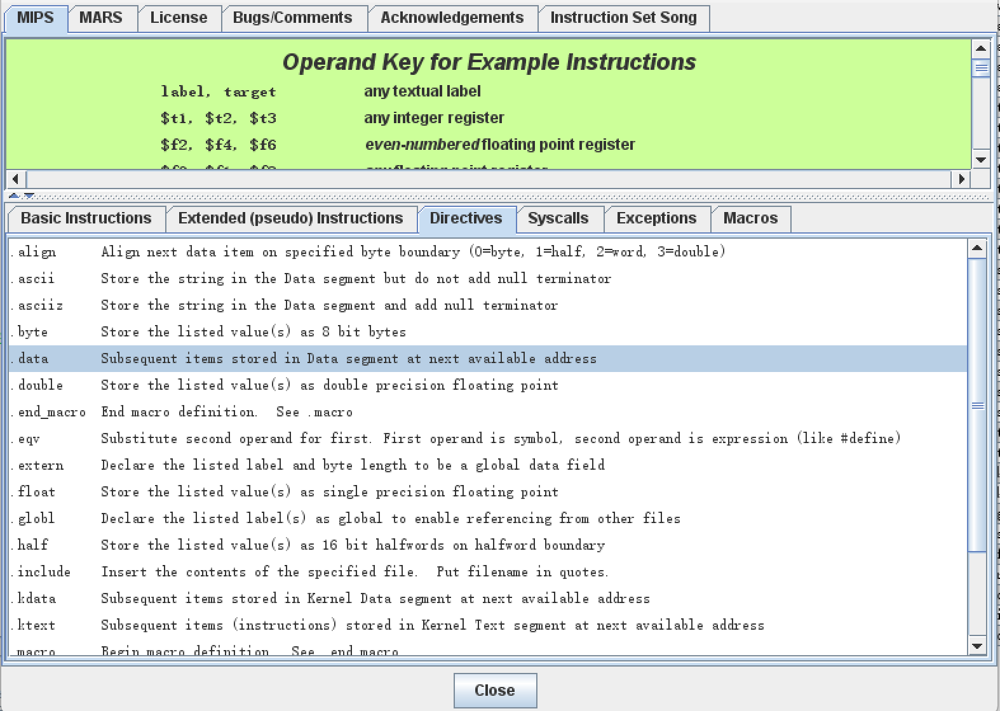

2. `.word`：在数据段中存储一个或多个32位整数值，按字边界对齐存放。例如 array: .word 7, 8, 9 会在内存中连续分配三个32位整数。
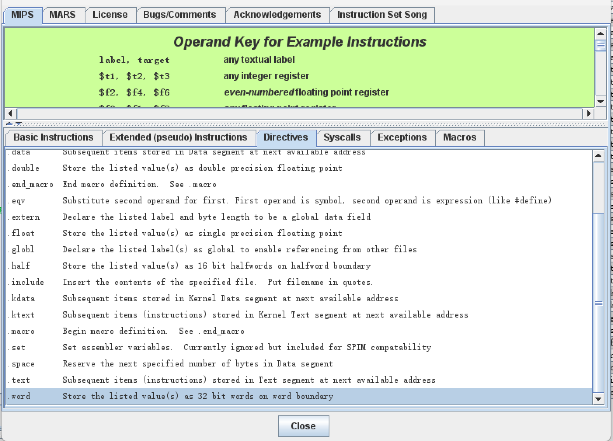

3. `.text`：指示后续的内容（指令代码）存放在代码段中，从下一个可用地址开始存储。程序真正要执行的每一条汇编指令都写在这个段下面。
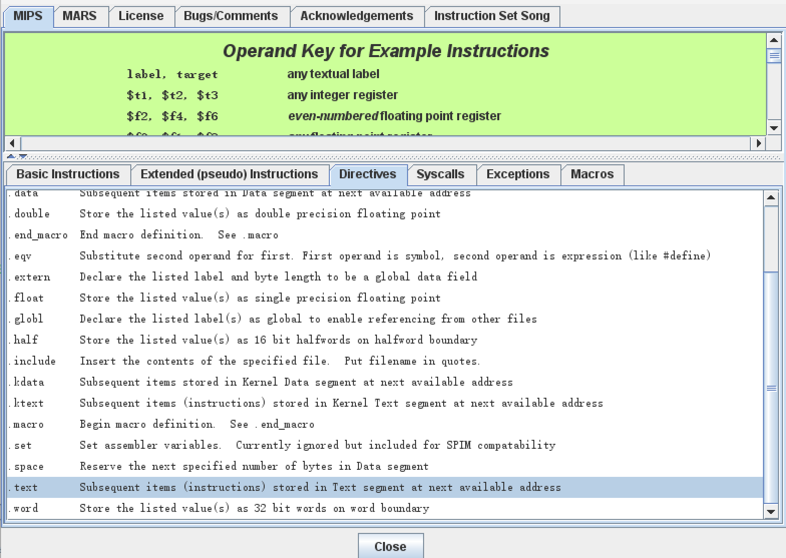

**b. 在MARS中如何设置断点breakpoint? 请在第15行设置断点，并记录在实验报告中。**

1. 将代码加载到mars中，并点击菜单中的`assemble the current file and clear the breakpoints`；
2. 点击15行的行号左侧的`Bkpt`空格，即可设置好断点。
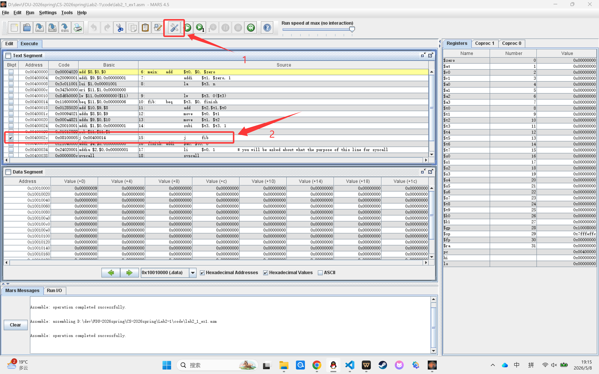

**c. 在程序运行到断点处停止时，如何继续执行? 如何单步调试代码?** 
在15行设置断点并运行一次程序，如下图所示。
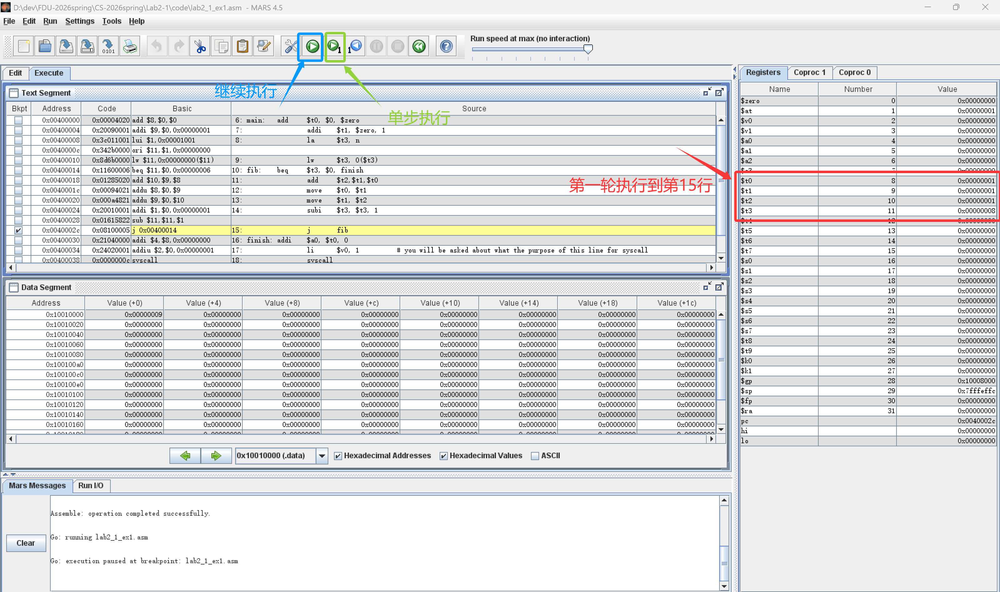

1. 点击`Continue`按钮（蓝色箭头），即可继续执行程序，在当前情况下再次点击，程序再次执行到第15行（断点所在行），如下图所示。
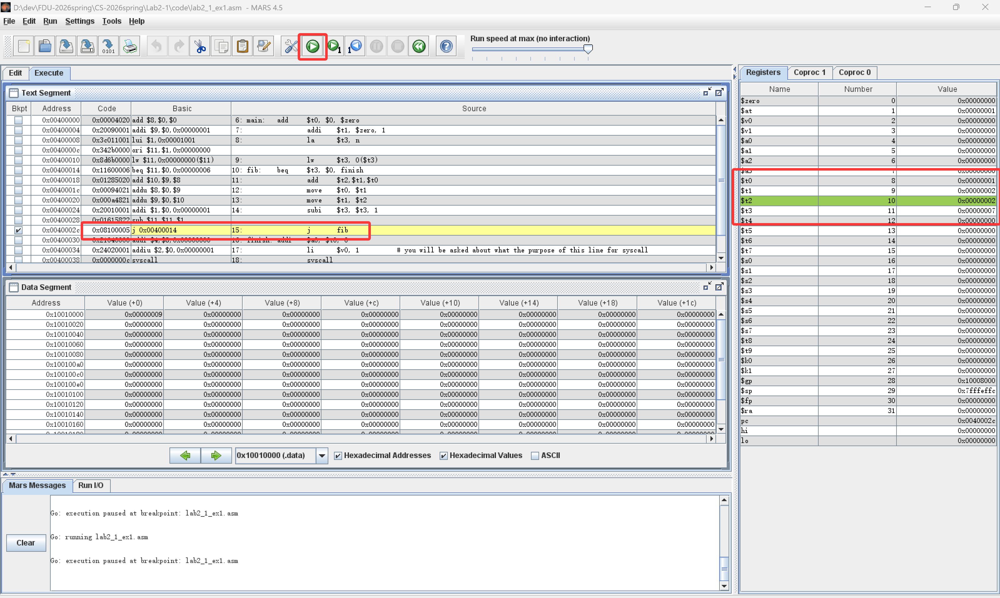

2. 点击`Step`按钮（绿色箭头），即可单步调试代码，在当前情况下再次点击，程序会执行到第10行（循环开始），如下图所示。
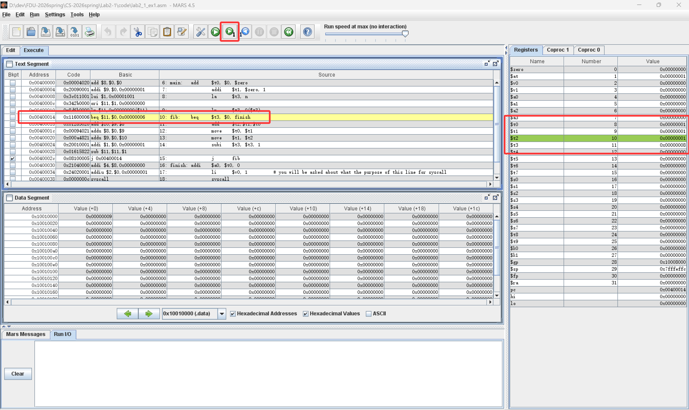

多次调试，观察右侧寄存器窗口，重点关注 `$t0`、`$t1`、`$t3` 三个值的变化：`$t3` 每轮减1，`$t0` 和 `$t1` 依次递推出下一个斐波那契数。最终 `$t3` 减到0，循环结束，`$t0` 中即为结果。       
通过继续执行可以快速看到每一循环的变化，通过单步执行可以清晰看到递推过程。

**d. 如何知道某个寄存器register的值是多少? 如何修改寄存器的值?**
1. 在MARS的右侧寄存器窗口中，可以看到所有寄存器的当前值。比如 `$t0`、`$t1`、`$t3` 等寄存器的值都会显示在这里。
2. 可以直接在寄存器窗口中修改寄存器的值，比如点击 `$t0` 下的输入框，输入新的值，即可修改 `$t0` 的值。
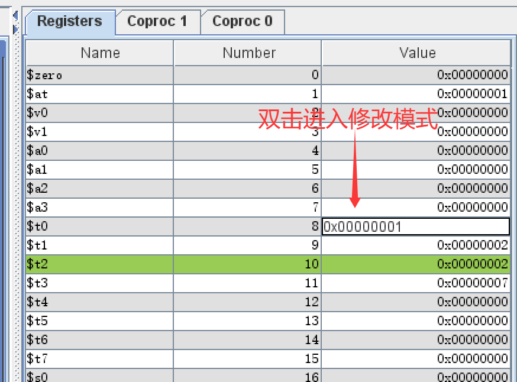

**e. n 存储在内存中的哪个地址? 通过修改此内存处的值来计算第13个fib数.**     
- 根据代码，我们知道n应该在 `.data` 段最开头的位置，且n的值为9。在开头部分（如第7行）打一个断点，可以看到n的地址为`0x10010000`，值为`0x00000009`。
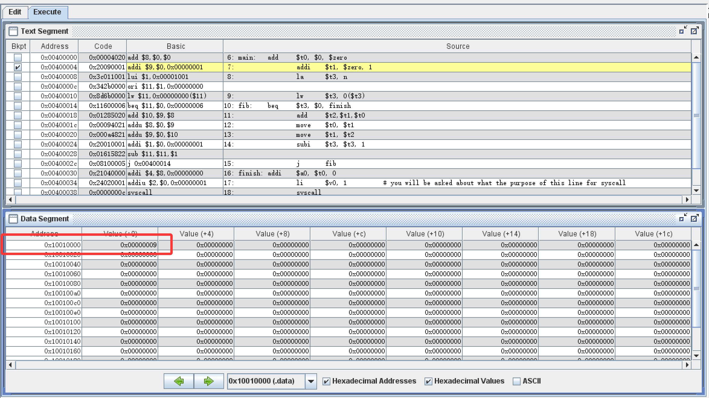

- 修改n的值为13（直接双击上图中`0x00000009`改成`0x0000000D`），即可继续运行程序，最终 `$t0` 中的值为233，即第13个斐波那契数。
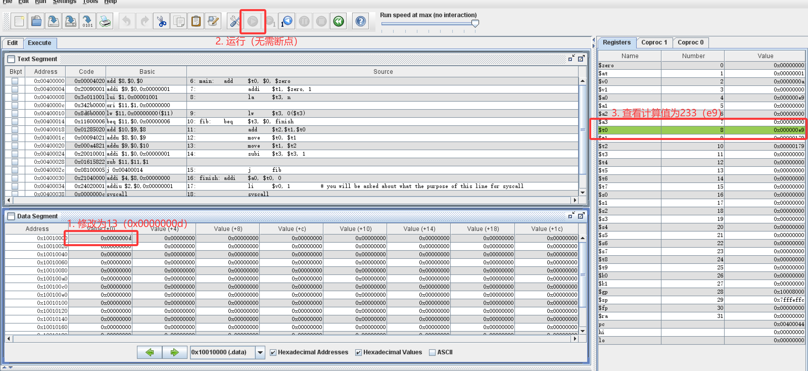

**f. 16 和 18 行使用了syscall指令. 其功能是什么，如何使用它?**
- syscall 是MIPS的系统调用指令，用于请求操作系统提供输入输出等服务。使用方式为：
    1. 将服务编号加载到 `$v0` 寄存器
    2. 将所需参数放入 `$a0`、`$a1` 等参数寄存器
    3. 执行 syscall 指令
    4. 如有返回值，从指定寄存器中获取

在本程序（lab2_1_ex1.asm）中：
- `li $v0, 1 + syscall`，调用 print integer 服务，将 `$a0` 中的整数值（即计算结果`fib(n)`）打印到控制台
- `li $v0, 10 + syscall`，调用 exit 服务，正常终止程序返回操作系统

调试如下：
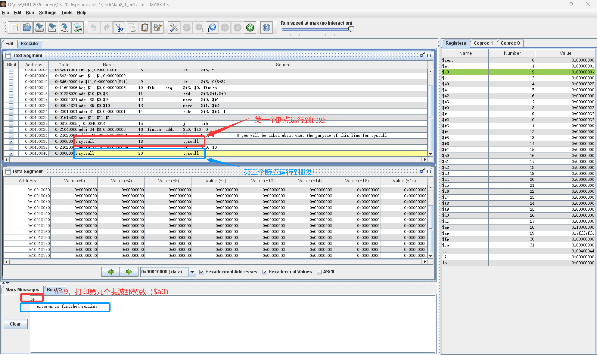

---

### 练习2：一个简短的MIPS程序

`lab2_1_ex2.asm`:
1. 只需要写计算逻辑的代码段，直接`.text`段开始。
2. 撰写递归计算逻辑的代码段，分别存储在对应寄存器中。
3. 最终调用`li $v0, 10 + syscall`，正常终止程序返回操作系统。

完整代码：
```asm
        .text
main: 	move $t0, $s0
        move $t1, $s1
        add $t2, $t0, $t1
        add $t3, $t1, $t2
        add $t4, $t2, $t3
        add $t5, $t3, $t4
        add $t6, $t4, $t5
        add $t7, $t5, $t6
        li $v0, 10
        syscall
```

手动设置`$s0`为5 `$s1`为7，运行结果如下：
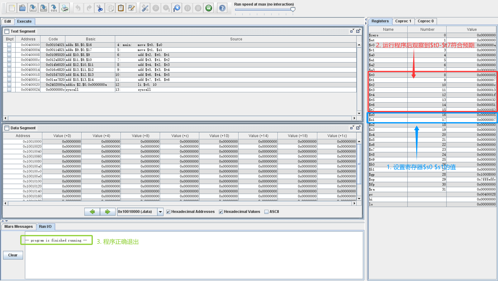

---

### 练习3：调试MIPS程序

对`lab2_1_ex3.asm`进行调试，发现以下问题：

1. **Bug 1：指针移动步长有误**

    ```asm
    addiu   $a0, $a0, 1     # 每次只加了 1 个字节
    addiu   $a1, $a1, 1
    ```
    `source` 和 `dest` 里存的是字节word，每个占4字节，应该一次移动4个字节。

2. **Bug 2：计数器 `$v0` 未初始化**
    `$v0`未清零，一开始可能是随机值，直接往上加会导致统计的复制个数错误。  

3. **Bug 3：循环逻辑有误**
    现在的循环逻辑是：
    1. 读一个数
    2. 计数器 +1
    3. 把数写到 dest
    4. 指针后移
    5. 如果这个数不为0，继续循环
    
    因此，读到 0 的时候，已经把它复制到 dest 并且计数器已经加了 1，然后才跳出循环，不符合需求。

修改如下：
1. 把步长 1 改成 4。
2. 初始化计数器 `$v0` 为0。
3. 更改循环逻辑，先判断是否为0再做其他操作。

`lab2_1_ex3_ok.asm`:
```asm
          .data
source:   .word   3, 1, 4, 1, 5, 9, 0
dest:     .word   0, 0, 0, 0, 0, 0, 0
countmsg: .asciiz " values copied. "

          .text

main:   la      $a0, source
        la      $a1, dest
        li      $v0, 0               # 计数器清零

loop:   lw      $v1, 0($a0)          # 读 source 当前值
        beq     $v1, $zero, loopend  # 如果是 0，退出循环
        sw      $v1, 0($a1)          # 写入 dest
        addiu   $v0, $v0, 1          # 计数器 +1
        addiu   $a0, $a0, 4          # 指针移动到下一个 word (4字节偏移)
        addiu   $a1, $a1, 4
        j       loop                 # 继续循环

loopend:
        move    $a0, $v0             # 打印复制的个数
        jal     puti

        la      $a0, countmsg
        jal     puts

        li      $a0, 0x0A
        jal     putc

finish:
        li      $v0, 10
        syscall
```

---

### 练习4：编写程序 - 计算数组平均数

编写程序实现将一个数组`a[8]={7,8,9,10,8,1,1,1}`的8个数平均数（只保留整数），并输出。

`lab2_1_ex4.asm`:
```asm
        .data
a:      .word   7, 8, 9, 10, 8, 1, 1, 1   # 数组
n:      .word   8                         # 数组长度

        .text
main:
        la      $a0, a          # $a0 = 数组基地址
        lw      $t0, n          # $t0 = 长度 (8)
        add     $t1, $zero, $zero   # $t1 = 累加和，初始0
        add     $t2, $zero, $zero   # $t2 = 循环计数器 i，初始0

loop:
        beq     $t2, $t0, avg  # i == 8 时跳去求平均
        lw      $t3, 0($a0)    # 取当前数组元素
        add     $t1, $t1, $t3  # sum += a[i]
        addiu   $a0, $a0, 4    # 指针移到下一个 word
        addiu   $t2, $t2, 1    # i++
        j       loop

avg:
        div     $t1, $t0       # sum / 8
        mflo    $a0            # 商（整数部分）放入 $a0
        li      $v0, 1         # print integer
        syscall

exit:
        li      $v0, 10        # 退出程序
        syscall
```

**运行结果**：数组元素之和为 7+8+9+10+8+1+1+1 = 45，平均数为 45/8 = 5（整数部分）。
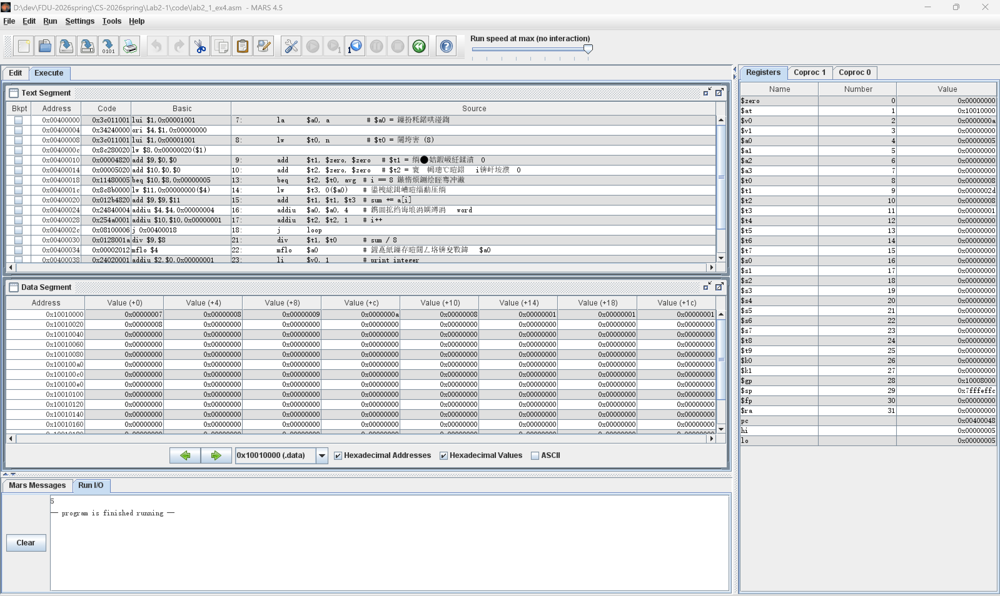

---

### 练习5：编写程序 - 找出数组最小值

编写程序实现将一个数组`a[5]={7,8,9,10,8}`数组中的最小值放入到`b`中。

`lab2_1_ex5.asm`:
```asm
        .data
a:      .word   7, 8, 9, 10, 8       # 数组
n:      .word   5                    # 数组长度
b:      .word   0                    # 存放最小值，初始为0

        .text
main:
        la      $t0, a              # $t0 指向数组首地址
        lw      $t1, n              # $t1 = 数组长度 (5)
        add     $t2, $zero, $zero   # $t2 = 循环计数器 i = 0

        # 初始化最小值为第一个元素
        lw      $t3, 0($t0)         # $t3 = min = a[0]
        addiu   $t0, $t0, 4         # 指针后移
        addiu   $t2, $t2, 1         # i = 1（已经处理了一个）

loop:
        beq     $t2, $t1, done      # 如果 i == n，结束循环
        lw      $t4, 0($t0)         # $t4 = 当前元素 a[i]
        slt     $t5, $t4, $t3       # 如果 a[i] < min，$t5 = 1
        beq     $t5, $zero, skip    # 如果 $t5==0，说明不小于，跳过更新
        add     $t3, $t4, $zero     # 更新 min = a[i]
skip:
        addiu   $t0, $t0, 4         # 指针移到下一个元素
        addiu   $t2, $t2, 1         # i++
        j       loop

done:
        # 将最小值存入变量 b
        sw      $t3, b

        # 以下代码用于打印最小值（方便验证）
        lw      $a0, b              # $a0 = 最小值
        li      $v0, 1              # print integer
        syscall

        # 退出程序
        li      $v0, 10
        syscall
```

**运行结果**：数组`{7,8,9,10,8}`中的最小值为 7，存入变量`b`中。
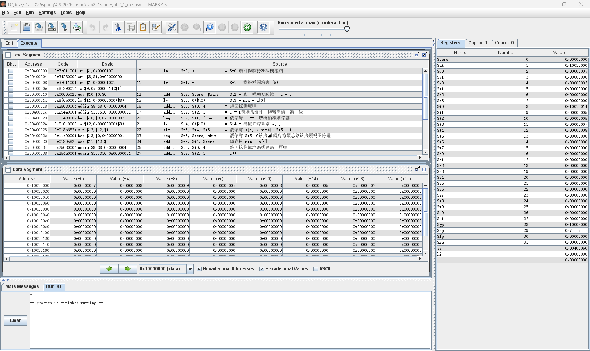

---

## 四、实验思考

### 1. 遇到的问题及解决方法

1. **问题描述**：在练习4中使用除法指令时不熟悉MIPS指令集，导致`div`无法正确实现除法操作。
   **解决方法**：查阅MIPS指令集文档，了解到`div`指令的工作机制。MIPS架构中没有专门的除法结果寄存器，`div`指令执行除法操作后，结果并不直接存放在通用寄存器中，而是存放在两个特殊的硬件寄存器中：
   - **LO寄存器**：存放除法的商（quotient）
   - **HI寄存器**：存放除法的余数（remainder）
   
   因此，必须从这两个寄存器中取出结果：
   - `mflo $rd`（move from LO）：将LO寄存器中的商移动到目标寄存器`$rd`
   - `mfhi $rd`（move from HI）：将HI寄存器中的余数移动到目标寄存器`$rd`
   
   在练习4的平均数计算中，只需要商（整数部分），所以使用`mflo $a0`将商存入`$a0`寄存器用于输出显示。如果需要余数，可以使用`mfhi`指令获取。

### 2. 实验心得
- 深入理解了MARS仿真器的使用方法，掌握了断点设置和单步调试技巧
- 学会了如何查看和修改寄存器及内存的值
- 理解了基本的MIPS指令集，包括算术指令、逻辑指令、跳转指令等
- 理解了MIPS汇编程序的基本结构和指令执行流程
- 学会了编写和调试简单的MIPS程序

## 五、实验评价

### 1. 自我评价
- 实验完成度：□***优秀*** □良好 □一般 □待提高
- 掌握程度：□***很好*** □较好 □一般 □需要加强

### 2. 实验反馈
1. 实验内容难度：□偏难 ***□适中*** □偏易
2. 实验时间安排：□充足 ***□适中*** □紧张