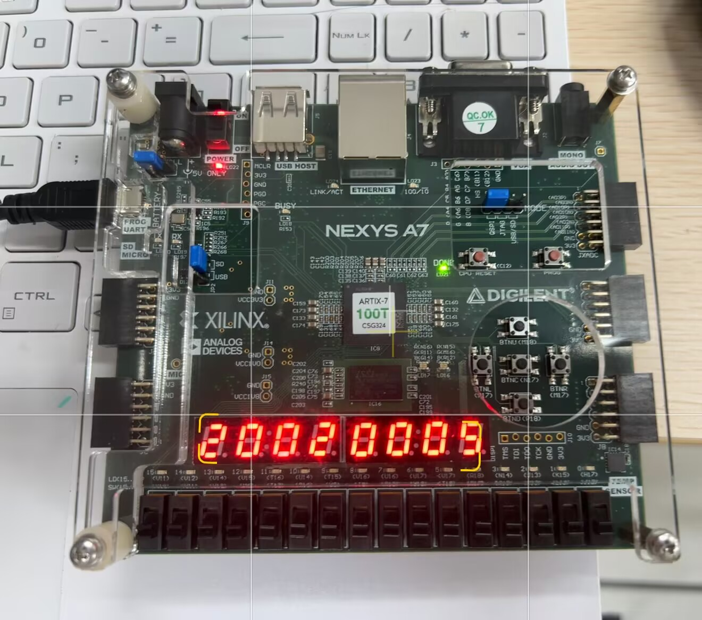
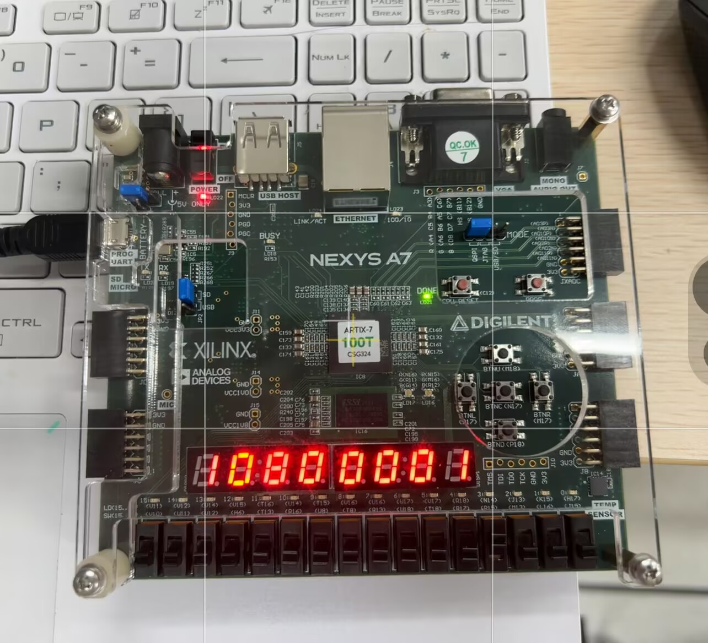
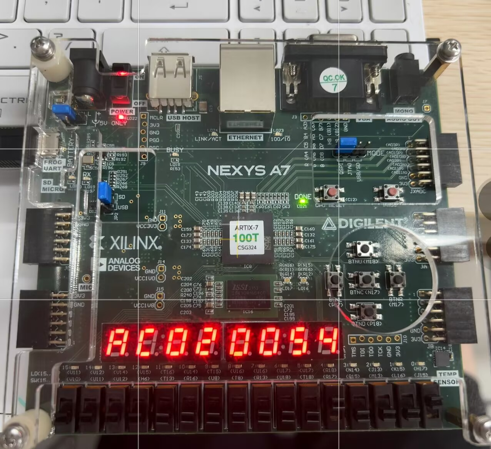

# 计算机组成原理实验报告

## 基本信息
- 实验名称：Lab3-1
- 姓名：陈一璟
- 学号：24300120183


## 一、实验目的

1. 了解RAM/ROM的基本原理，掌握调用 Xilinx 库 IP（Block Memory Generator）实例化 ROM/RAM的方法。  
2. 掌握单周期 CPU 中各个控制信号的作用及其生成过程。  
3. 掌握单周期 CPU 控制器的工作原理与设计方法，能够根据指令译码产生相应的控制信号。  
4. 理解单周期 CPU 执行指令的过程，掌握取指阶段和译码阶段的数据通路与控制器的执行流程。  
5. 学会在 FPGA 开发板上使用七段数码管和 LED 灯观察指令及控制信号，验证设计的正确性。


## 二、实验内容

### lab 3-1-1：Head First Register
- 使用 Xilinx Block Memory Generator IP 核构造一个只读存储器（ROM）。  
- 设置 ROM 的数据宽度为 32 位，深度为 256（地址线 8 根）。  
- 提供一个 COE 文件作为 ROM 的初始值（包含若干 32 位十六进制数据）。  
- 将 ROM 实例化到顶层设计中，通过板上的 8 个开关提供地址，将对应地址的数据读出并显示在七段数码管上（一次显示 8 个十六进制数）。  
- 掌握 ROM IP 核的调用、实例化以及上板验证方法。

### lab 3-1-2：Register and Controller
- 搭建一个单周期 CPU 的取指和译码阶段电路，包括以下模块：  
  1. **时钟分频器**：将板载 100MHz 时钟分频为 1Hz，作为系统主时钟。  
  2. **PC 模块**：D 触发器结构，存储当前指令地址，复位后从 0 开始，每个时钟周期更新为 PC + 4。输出 PC 和指令存储器使能信号 `inst_ce`。  
  3. **加法器**：计算 `PC + 4`。  
  4. **指令存储器**：使用 Block Memory Generator IP 配置为 ROM，加载提供的 `mipstest.coe` 文件（包含 MIPS 指令机器码）。  
  5. **控制器**（`controller.v`）：  
     - `main_decoder`：根据指令的高 6 位 `op` 生成 `regwrite`, `regdst`, `alusr`, `branch`, `memwrite`, `memtoreg`, `jump`, `aluop` 等控制信号。  
     - `alu_decoder`：根据 `funct` 和 `aluop` 生成 `alucontrol[2:0]`（ALU 运算类型）。  
     - 顶层 `controller` 调用两个 decoder，输出所有控制信号。  
- 将控制信号映射到开发板 LED 灯上。  
- 将当前指令显示在七段数码管上。  
- 观察随着 1Hz 时钟运行，LED 灯状态和数码管显示按指令顺序变化，验证控制器逻辑的正确性。


## 三、实验要求

### 对实验 3-1-1 的要求
- 在 Vivado 中正确添加并配置 Block Memory Generator IP，设置 ROM 模式、32 位数据宽度、256 深度，并加载 COE 文件。  
- 编写顶层文件，将 ROM 的地址端口连接到 8 个开关，数据输出连接到七段数码管显示模块。  
- 综合、实现、生成比特流，下载到 Basys3 开发板。  
- 通过开关改变地址，验证数码管显示的数据与 COE 文件中对应地址的数据一致。  
- 将显示结果拍照或截图，写入实验报告。

### 对实验 3-1-2 的要求
- 按照实验原理图（图 1）搭建完整的取指‑译码系统，自行实现以下模块：  
  - `clk_div.v`：100MHz → 1Hz 分频器。  
  - `pc.v`：D 触发器结构，带复位，输出 `pc` 和 `inst_ce`。  
  - `controller.v`：包含 `main_decoder` 和 `alu_decoder`，根据指令产生全部控制信号。  
- 指令存储器使用 Block Memory Generator IP，配置为 ROM，加载提供的 `mipstest.coe` 文件。  
- 将控制器输出的控制信号按下表连接至板上的 LED 灯（共 11 个 LED）：

| 控制信号   | 对应 LED |
|------------|----------|
| memtoreg   | LED[0]   |
| memwrite   | LED[1]   |
| pcsrc      | LED[2]   |
| alusr      | LED[3]   |
| regdst     | LED[4]   |
| regwrite   | LED[5]   |
| jump       | LED[6]   |
| branch     | LED[7]   |
| alucontrol | LED[10:8]|

- 将当前指令显示在七段数码管上，支持显示完整指令（32 位）。  


## 四、实验结果

### Lab3-1-1结果

#### 1. 模块代码

##### top.v

- 顶层模块，实例化了 ROM IP 核和显示模块，通过拨码开关选择 ROM 地址并将指令显示在数码管上。

```verilog
module top(
    input  wire       clk,
    input  wire       rst,
    input  wire [7:0] sw,       // 8个拨码开关用于ROM寻址
    output wire [7:0] ans,      // 数码管位选
    output wire [6:0] seg       // 数码管段选
);
    wire [31:0] instruction;    // ROM输出的32位指令

    // IP核实例化
    // 选择 always enable，没有ena端口
    Ins_Rom u_rom (
        .clka(clk),             // 时钟输入
        .addra(sw),             // 地址由拨码开关提供
        .douta(instruction)     // 输出32位指令
    );

    // 显示模块：将32位指令显示在8个七段数码管上
    display u_display (
        .clk(clk),
        .reset(rst),
        .s(instruction),
        .ans(ans),
        .seg(seg)
    );

endmodule
```

##### display.v

- 显示模块，将32位指令显示在8个七段数码管上，实现扫描分频显示。

```verilog
`timescale 1ns / 1ps

module display(
    input wire clk,reset,
    input wire [31:0]s,
    output wire [6:0]seg,
    output reg [7:0]ans
    );
    reg [20:0]count;    // 用于时钟分频，原始时钟信号有100MHz
    reg [2:0] sel;       // 数码管选择信号
    reg [3:0] digit;     // 要显示的4位数据
    reg [31:0] s_reg;    // 存储结果的寄存器

    // 时钟分频
    always @(posedge clk or posedge reset) begin
        if(reset) begin
            count <= 0;
            sel <= 0;
            s_reg <= 0;
        end else begin
            count <= count + 1;
            if(count == 21'd100000) begin // 100MHz / 100000 = 1kHz
                count <= 0;
                sel <= sel + 1;
                if(sel == 3'd7) begin
                    sel <= 0;
                    s_reg <= s; // 更新显示数据
                end
            end
        end
    end

    // 数码管选择和数据显示
    always @(*) begin
        case(sel)
            3'd0: begin ans = 8'b11111110; digit = s_reg[3:0]; end     // 最低位
            3'd1: begin ans = 8'b11111101; digit = s_reg[7:4]; end
            3'd2: begin ans = 8'b11111011; digit = s_reg[11:8]; end
            3'd3: begin ans = 8'b11110111; digit = s_reg[15:12]; end
            3'd4: begin ans = 8'b11101111; digit = s_reg[19:16]; end
            3'd5: begin ans = 8'b11011111; digit = s_reg[23:20]; end
            3'd6: begin ans = 8'b10111111; digit = s_reg[27:24]; end
            3'd7: begin ans = 8'b01111111; digit = s_reg[31:28]; end   // 最高位
            default: begin ans = 8'b11111111; digit = 4'h0; end
        endcase
    end

    seg7 U4(.din(digit),.dout(seg));
endmodule
```

##### seg7.v

- 七段数码管译码模块，将4位二进制输入转换为七段显示信号（支持0-F）。

```verilog
`timescale 1ns / 1ps

module seg7(
    input wire [3:0]din,
    output reg [6:0]dout
    );

    always@(*)
    case(din)
        4'b0000: dout=7'b1000000;   //0
        4'b0001: dout=7'b1111001;   //1
        4'b0010: dout=7'b0100100;   //2
        4'b0011: dout=7'b0110000;   //3
        4'b0100: dout=7'b0011001;   //4
        4'b0101: dout=7'b0010010;   //5
        4'b0110: dout=7'b0000010;   //6
        4'b0111: dout=7'b1111000;   //7
        4'b1000: dout=7'b0000000;   //8
        4'b1001: dout=7'b0010000;   //9
        4'b1010: dout=7'b0001000;   //A
        4'b1011: dout=7'b0000011;   //B
        4'b1100: dout=7'b1000110;   //C
        4'b1101: dout=7'b0100001;   //D
        4'b1110: dout=7'b0000110;   //E
        4'b1111: dout=7'b0001110;   //F
        default: dout=7'b1111111;   
    endcase

endmodule
```

##### mipstest.coe

使用实验提供的资料文件，共初始化18条指令（0-17）。

**实验板结果：**

| 地址 | 指令 | 实验板显示 |
| :--- | :--- | :--- |
| 0x00（最低位） | `20020005` (addi $v0, $0, 5) |  |
| 0x08（中间任意一位） | `10a7000a` (beq $t2, $t7, 0x0a) |  |
| 0x11（最高位） | `20020001` (addi $v0, $0, 1) |  |

**实验现象说明：**

1. 通过拨码开关 `sw[7:0]` 选择 ROM 地址，实验板上的 8 个七段数码管会显示对应地址的 32 位 MIPS 指令
2. 数码管采用动态扫描方式显示，从左到右依次显示指令的高字节到低字节
3. 图中显示了三个典型地址的指令内容，验证了 ROM 初始化和显示功能的正确性

### Lab3-1-2结果

（模块代码）

（实验板结果）

## 五、实验思考
### 1. 遇到的问题及解决方法
1. 问题描述：`branch` 信号没有在controller中给输出
   解决方法：删除`wire branch` 并改为output branch

2. 问题描述：输出端口声明为 `wire`，但在 `always @(*)` 中赋值，生成bitstream时报错
   解决方法：将所有输出端口类型从 `wire` 改为 `reg`

3. 问题描述：按照lab 3-1-1的步骤，选择的是always enable，因此在lab3-1-2中inst_ce将悬空连接      
   解决方法：尝试在创建IP核时选择use pin并将ena连接到inst_ce，符合实验要求


### 2. 实验心得
（描述通过本次实验学到的知识和技能）


## 六、实验评价
### 1. 自我评价

> 将选择的项加粗加斜即可
>
> 例如：□***优秀*** □良好 □一般 □待提高

- 实验完成度：□优秀 □良好 □一般 □待提高
- 掌握程度：□很好 □较好 □一般 □需要加强

### 2. 实验反馈
1. 实验内容难度：□偏难 □适中 □偏易
3. 实验时间安排：□充足 □适中 □紧张

### 3. 建议与改进（可选）
> 对实验内容等方面的建议