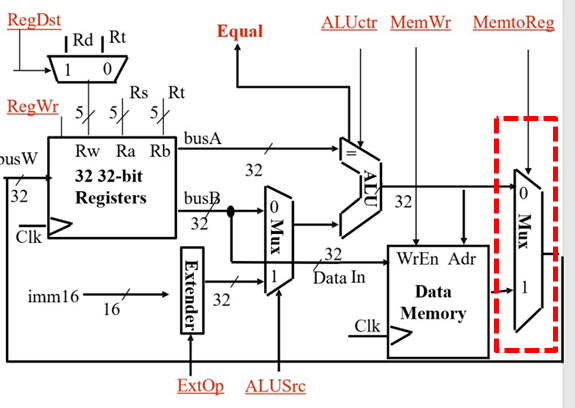
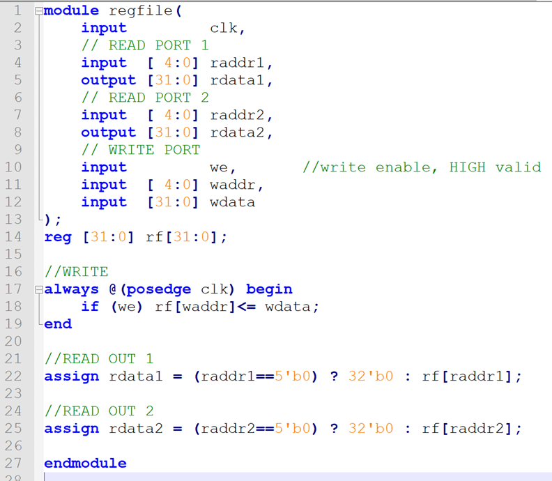

# Lab3-2-1 寄存器堆实验

## 实验目的

学习寄存器堆的数据传送与读写工作原理，掌握寄存器读写的设计方法

## 寄存器堆设计实验

下图红色框里给出了一个寄存器堆电路符号，寄存器堆存有 32 个 registers, 能够通过 3 个 5 位地址总线 Rw, Ra, Rb 寻址到寄存器，RW 是写信号，RW=1 时，将busW 的数据存储到 Rw 的地址所对应的 register 里面。RW=0 时, 根据地址 Ra, Rb 地址读取寄存器的值，放到 busA 和busB 上。


### 实验要求

1. 根据寄存器堆（register file）原理图，使用 Verilog 语言定义 register file 模块；

2. 将所涉及的 ALU（Lab1-5） 与 register file 模块连起来，形成如图1所示的系统；

3. 图 2 在图 1的基础上加入了多路选择器的部件，用来选择寄存器的写入数据是根据 ALU还是根据存储器来进行写入。**根据图 2 中红色框框里面的原理，完成一次模拟存储器写入**，通过 MemtoReg 控制信号来确定 busW 信号是来之存储器的常数还是 ALU 输出的结果，通过下列语句可以实现：

   ```verilog
   busW=(MemtoReg==1)? 32'b1: result；
   ```

​	其中假设存储器恒定输出 32'b1（也可以固定成其他值），result 是 ALU 的输出；往\$t1, $t2里面写入 32'b1（也可以固定成其他值），**通过仿真验证写入过程的正确性**；（思考存储器是用ROM还是RAM？具体如何构建存储器查看Lab3-1-1实验）

4. 在\$t1,\$t2 初始值的基础上，模拟指令 add \$t0, \$t1, $t2 的过程，**通过仿真验证 add 计算过程的正确性**。

5. 仿真程序自行构建完成，无需上板验证，需要提交整个项目文件并命名为Lab3-2-1放于压缩包下。




### 实验环境

register file 实验给出了逻辑实现方式：



