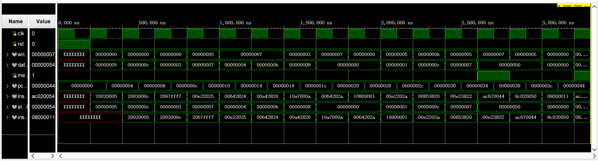
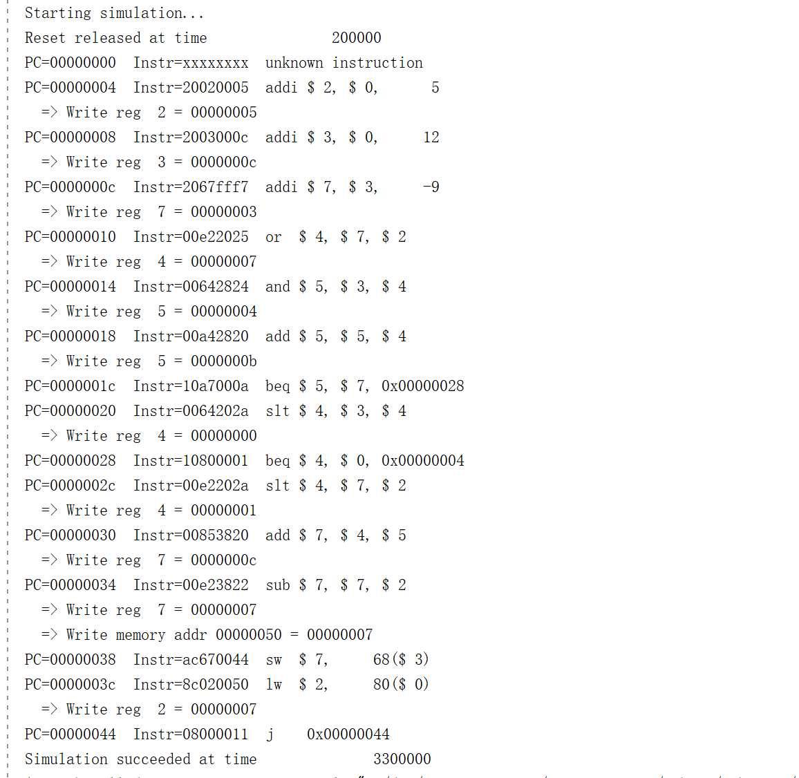

# 计算机组成原理实验报告

## 基本信息
- 实验名称：Lab3-2
- 姓名：陈一璟
- 学号：24300120183

## 一、实验目的

- 掌握寄存器堆（Register File）的数据传送与读写工作原理，掌握寄存器读写的设计方法，并能够将寄存器堆与 ALU 集成，模拟基本运算指令的执行过程。
- 掌握单周期 CPU 数据通路图的构成、原理及其设计方法，能够将 PC、寄存器堆、ALU、控制器、存储器等模块按数据通路图连接，搭建完整的单周期 MIPS 处理器。
- 理解指令与 CPU 执行过程的关系，掌握通过仿真验证处理器功能正确性的方法。

## 二、实验内容

### Lab 3-2-1：寄存器堆设计实验
本部分实验要求设计一个 32×32 位的寄存器堆模块，并使其与 ALU 和多路选择器协同工作，模拟执行一条加法指令。具体包括：
- 设计寄存器堆，支持两个读端口（组合逻辑）和一个写端口（时序逻辑），写使能控制写入。
- 将 ALU 与寄存器堆相连，并加入一个由 `MemtoReg` 控制的二选一选择器，用于选择写入寄存器的数据来源（常数 32’b1 或 ALU 结果）。
- 通过仿真向 `St1`、`St2` 写入常数 1，然后模拟执行 `add St0, St1, St2`，验证加法结果是否正确写回 `St0`。

### Lab 3-2-2：单周期 CPU 设计实验
本部分实验在 Lab 3-2-1 的基础上，整合 PC、控制器、存储器 IP、符号扩展、移位器、加法器、多路选择器等模块，构建完整的单周期 MIPS 处理器数据通路。具体包括：
- 实现控制器（`maindec`、`aludec`、`controller`），产生各类控制信号。
- 实现数据通路（`datapath`），连接 PC、寄存器堆、ALU、符号扩展、移位器、多路选择器等组件，支持 `add, sub, and, or, slt, addi, beq, j, lw, sw` 指令。
- 使用 Vivado Block Memory Generator 生成指令 ROM（`inst_mem`）和数据 RAM（`data_mem`），加载测试程序。
- 编写仿真测试激励，通过仿真验证每条指令的执行过程，并最终在指定地址写入预期值，证明 CPU 功能正确。

## 三、实验要求

### Lab 3-2-1 要求
1. 根据寄存器堆原理图，使用 Verilog 语言定义 `regfile` 模块（32 个 32 位寄存器，3 个 5 位地址口，1 个写使能，2 个读数据口）。
2. 将之前实验完成的 ALU 与 `regfile` 模块相连，形成运算系统。
3. 加入由 `MemtoReg` 控制的二选一多路选择器，选择写入寄存器的数据来源（恒定常数 32’b1 或 ALU 结果）。向 `St1`、`St2` 写入常数 1，通过仿真验证写入正确性。
4. 在 `St1`、`St2` 已写入初值的基础上，模拟执行 `add St0, St1, St2`：从 `St1`、`St2` 读出数据送至 ALU 做加法，结果通过 `MemtoReg=0` 写回 `St0`，仿真验证加法结果正确性。
5. 仿真程序自行构建，无需上板验证，需提交整个项目文件，命名为 `Lab3-2-1.zip`。

### Lab 3-2-2 要求
1. 阅读实验原理部分，实现下列模块（部分可复用前期实验成果）：
   - 数据通路（`datapath`），包含 ALU、寄存器堆、PC、控制器、加法器、多路选择器、符号扩展、移位器等。
   - 指令存储器（`inst_mem`，Single Port ROM）和数据存储器（`data_mem`，Single Port RAM），使用 Block Memory Generator IP 核构造，注意 PC 地址位数统一。
   - 控制器（`controller`）包含主译码器（`maindec`）和 ALU 译码器（`aludec`），参照实验 Lab3-1-2 代码。
2. 参照实验给出的单周期 CPU 系统连线图，将上述模块按指令执行顺序连接。顶层文件需兼容提供的 `top.v` 端口设定。
3. 使用实验提供的仿真程序（或自行编写 testbench）进行仿真验证，最终以仿真输出结果判断是否成功实现所有要求的指令（`add, sub, and, or, slt, addi, beq, j, lw, sw`）。
4. 在指令存储器中存入给定的测试程序（汇编代码及机器码），通过仿真验证每一类指令的结果，附上仿真波形图并说明其正确性。需说明所设计的处理器能够跑完所有代码，并在 `end` 处执行了正确的代码。
5. 提交整个项目文件，命名为 `Lab3-2-2.zip`。


## 四、实验结果

### Lab3-2-1结果

#### 1. 代码设计

1. `regfile.v` ：32×32寄存器堆，组合读、时序写，$0恒为0

```verilog
module regfile(
    input clk,
    input RW,
    input [4:0] Rw,
    input [4:0] Ra,
    input [4:0] Rb,
    input [31:0] busW,
    output [31:0] busA,
    output [31:0] busB
);

reg [31:0] mem [0:31];

assign busA = mem[Ra];
assign busB = mem[Rb];

always @(posedge clk) begin
    if (RW) begin
        mem[Rw] <= busW;
    end
end

endmodule
```

2. `alu.v` ：ALU，支持加法、减法、与、或、SLT 等运算

```verilog
module alu(
    input [31:0] a,
    input [31:0] b,
    input [2:0] ALUControl,
    output [31:0] result,
    output zero
);

reg [31:0] result_reg;

always @(*) begin
    case (ALUControl)
        3'b000: result_reg = a & b;
        3'b001: result_reg = a | b;
        3'b010: result_reg = a + b;
        3'b110: result_reg = a - b;
        3'b111: result_reg = ($signed(a) < $signed(b)) ? 32'd1 : 32'd0;
        default: result_reg = 32'd0;
    endcase
end

assign result = result_reg;
assign zero = (result_reg == 32'b0);

endmodule
```

- `mux2.v` ：二选一选择器，选择写入数据来自常数 32’b1 或 ALU 结果

```verilog
module mux2(
    input [31:0] in0,
    input [31:0] in1,
    input sel,
    output [31:0] out
);

assign out = sel ? in1 : in0;

endmodule
```

3. `top.v` ：顶层，例化上述模块并连接控制信号

```verilog
module top(
    input clk,
    input rst,
    // 控制信号（由 testbench 提供）
    input RW,
    input MemtoReg,
    input [4:0] Rw,
    input [4:0] Ra,
    input [4:0] Rb,
    input [2:0] ALUControl,
    // 可选观察输出（便于波形查看）
    output [31:0] busA,
    output [31:0] busB,
    output [31:0] alu_result,
    output [31:0] busW
);

wire [31:0] busA_w, busB_w, alu_result_w, busW_w;

alu alu_inst(
    .a(busA_w),
    .b(busB_w),
    .ALUControl(ALUControl),
    .result(alu_result_w),
    .zero()
);

mux2 mux2_inst(
    .in0(alu_result_w),
    .in1(32'd1),
    .sel(MemtoReg),
    .out(busW_w)
);

regfile regfile_inst(
    .clk(clk),
    .RW(RW),
    .Rw(Rw),
    .Ra(Ra),
    .Rb(Rb),
    .busW(busW_w),
    .busA(busA_w),
    .busB(busB_w)
);

// 连接到输出端口
assign busA = busA_w;
assign busB = busB_w;
assign alu_result = alu_result_w;
assign busW = busW_w;

endmodule
```

4. `tb_top.v` ：仿真激励，产生时钟、复位及测试序列

```verilog
`timescale 1ns / 1ps

module tb_top;

// 输入信号
reg clk;
reg rst;
reg RW;
reg MemtoReg;
reg [4:0] Rw;
reg [4:0] Ra;
reg [4:0] Rb;
reg [2:0] ALUControl;

// 输出信号（连接到 top 模块）
wire [31:0] busA;
wire [31:0] busB;
wire [31:0] alu_result;
wire [31:0] busW;

// 实例化 top 模块
top u_top (
    .clk(clk),
    .rst(rst),
    .RW(RW),
    .MemtoReg(MemtoReg),
    .Rw(Rw),
    .Ra(Ra),
    .Rb(Rb),
    .ALUControl(ALUControl),
    .busA(busA),
    .busB(busB),
    .alu_result(alu_result),
    .busW(busW)
);

// 时钟生成：周期 10ns
always #5 clk = ~clk;

// 测试流程
initial begin
    // 初始化所有控制信号
    clk = 0;
    rst = 1;
    RW = 0;
    MemtoReg = 0;
    Rw = 5'b0;
    Ra = 5'b0;
    Rb = 5'b0;
    ALUControl = 3'b010;   // 加法（默认）

    // 复位释放
    #15 rst = 0;
    #5;

    // ========== 步骤1：向 St1 写入 32'd1 ==========
    $display("Step 1: Write St1 = 1");
    MemtoReg = 1;           // 选择常数 32'd1 作为写入数据
    RW = 1;                 // 写使能
    Rw = 5'd1;              // 目标地址 St1
    @(posedge clk);         // 等待写入时钟沿
    #1;                     // 保持稳定后观察

    // ========== 步骤2：向 St2 写入 32'd1 ==========
    $display("Step 2: Write St2 = 1");
    Rw = 5'd2;              // 目标地址 St2
    @(posedge clk);         // 写入
    #1;

    // ========== 步骤3：验证写入 St1 和 St2 的值 ==========
    $display("Step 3: Read St1 and St2");
    RW = 0;                 // 读模式
    Ra = 5'd1;
    Rb = 5'd2;
    #10;                    // 等待组合逻辑稳定
    $display("busA = %d, busB = %d (should be 1 and 1)", busA, busB);
    if (busA !== 32'd1 || busB !== 32'd1)
        $display("ERROR: Write verification failed!");

    // ========== 步骤4：模拟 ADD St0, St1, St2 ==========
    $display("Step 4: ADD St0, St1, St2");
    MemtoReg = 0;           // 选择 ALU 结果写入
    ALUControl = 3'b010;    // 加法运算
    RW = 1;
    Rw = 5'd0;              // 写回 St0
    Ra = 5'd1;              // ALU 源操作数1 来自 St1
    Rb = 5'd2;              // ALU 源操作数2 来自 St2
    @(posedge clk);         // 执行并写入
    #1;
    $display("alu_result = %d, busW = %d (should be 2)", alu_result, busW);

    // ========== 步骤5：验证 St0 是否为 2 ==========
    $display("Step 5: Verify St0 = 2");
    RW = 0;
    Ra = 5'd0;
    #10;
    $display("busA = %d (should be 2)", busA);
    if (busA !== 32'd2)
        $display("ERROR: ADD instruction failed!");

    // 仿真结束
    $display("Test completed.");
    #20;
    $finish;
end

endmodule
```

#### 2. 波形分析


| 时间 | 操作 | 关键信号 | 值 | 说明 |
|------|------|----------|----|------|
| 20ns | 写 St1 | `RW=1, Rw=1, MemtoReg=1, busW=1` | 1 | 向地址1写入常数1 |
| 20ns | 写 St2 | `RW=1, Rw=2, MemtoReg=1, busW=1` | 1 | 向地址2写入常数1 |
| 36ns | 读 St1, St2 | `RW=0, Ra=1, Rb=2, busA=1, busB=1` | 1, 1 | 验证写入成功 |
| 46ns | ADD 计算 | `MemtoReg=0, ALUControl=010, Ra=1, Rb=2, alu_result=2, busW=2` | 2 | ALU 计算 1+1=2，并准备写回 |
| 56ns | 读 St0 | `RW=0, Ra=0, busA=2` | 2 | 验证加法结果已写入 St0 |

- **写操作**：时钟上升沿且 `RW=1` 时，`busW` 的值写入 `Rw` 指定的寄存器。
- **读操作**：组合逻辑，`Ra`、`Rb` 变化后 `busA`、`busB` 立即更新。
- **多路选择**：`MemtoReg=1` 时 `busW` 为常数 1；`MemtoReg=0` 时 `busW` 为 ALU 结果。
- **ADD 指令**：源寄存器 `St1`、`St2` 读出 1 和 1，ALU 加法得 2，通过 `MemtoReg=0` 写回 `St0`，最终读出 2。


### Lab3-2-2结果

#### 1. 模块代码

##### 存储器IP核配置说明

| IP核 | 类型 | 深度 | 位宽 | 关键配置 |
|------|------|------|------|----------|
| `inst_mem` | Single Port ROM | 256 | 32 | Always Enabled，**不勾选 Primitive Output Register** |
| `data_mem` | Single Port RAM | 256 | 32 | Always Enabled，Write First，**不勾选 Primitive Output Register** |

测试程序 `mipstest.coe` 初始化指令 ROM，包含完整的测试指令序列。

##### 复用模块（已在Lab3-2-1验证）

1. `regfile.v`：寄存器堆，支持同步写、组合读。
2. `alu.v`：算术逻辑单元，支持 add/sub/and/or/slt 等运算。
3. `mux2.v`：二选一选择器（参数化宽度）。
4. `adder.v`：32 位加法器（用于 PC+4 和分支地址计算）。

##### 新增模块

1. `pc.v`：程序计数器，采用下降沿触发（解决指令读取错位问题），复位时清零。

``` verilog

`timescale 1ns / 1ps

// 32位pc
module pc(
    input  wire        clk,       
    input  wire        rst,       
    input  wire [31:0] pc_next,   // 下一条指令的地址
    output reg  [31:0] pc,        // 当前指令地址（输出）
    output wire        inst_ce    // 指令使能信号
);

    assign inst_ce = 1'b1;   // 一直使能

    always @(negedge clk or posedge rst) begin
        if (rst)
            pc <= 32'h0000_0000;
        else
            pc <= pc_next;
    end

endmodule

```

2. `signext.v`: 16 位立即数符号扩展为 32 位。

```verilog

`timescale 1ns / 1ps

module signext(
	input wire[15:0] a,
	output wire[31:0] y
    );

	assign y = {{16{a[15]}},a};
endmodule
```

3. `sl2.v`: 32 位数据左移 2 位（用于分支偏移量计算）。

```verilog

`timescale 1ns / 1ps

module sl2(
	input wire[31:0] a,
	output wire[31:0] y
    );

	assign y = {a[29:0],2'b00};
endmodule

```     

4. `maindec.v`: 主译码器，根据 opcode 生成控制信号：RegWrite, RegDst, ALUSrc, Branch, MemWrite, MemtoReg, Jump, ALUop。

```verilog
`timescale 1ns / 1ps

module maindec(
	input wire[5:0] op,

	output wire memtoreg,memwrite,
	output wire branch,alusrc,
	output wire regdst,regwrite,
	output wire jump,
	output wire[1:0] aluop
    );

	reg [8:0] controls;
    assign {regwrite,regdst,alusrc,branch,memwrite,memtoreg,jump,aluop} = controls;
    always@(*) begin
        case(op) 
        6'b000000:controls<=9'b110000010;//R-TYPE
        6'b100011:controls<=9'b101001000;//LW               
        6'b101011:controls<=9'b001010000;//SW
        6'b000100:controls<=9'b000100001;//BEQ
        6'b001000:controls<=9'b101000000;//ADDI
        6'b000010:controls<=9'b000000100;//J
        default:  controls<=9'b000000000;//illegal
        endcase
    end 
endmodule

```

5. `aludec.v`:  ALU 译码器，根据 funct 和 ALUop 生成 ALUControl（支持 add/sub/and/or/slt）。

```verilog

`timescale 1ns / 1ps


module aludec(
	input wire[5:0] funct,
	input wire[1:0] aluop,
	output reg[2:0] alucontrol
    );

	always @(funct,aluop) 
	    begin
            case(aluop)
                2'b00: alucontrol = 3'b010;  // lw/sw
                2'b01: alucontrol = 3'b110;  // beq
                2'b10: begin
                    case(funct)
                        6'b100000: alucontrol = 3'b010;  // add
                        6'b100010: alucontrol = 3'b110;  // sub
                        6'b100100: alucontrol = 3'b000;  // and
                        6'b100101: alucontrol = 3'b001;  // or
                        6'b101010: alucontrol = 3'b111;  // slt
                        default:   alucontrol = 3'b000;  // 默认000
                    endcase
                end
                default: alucontrol = 3'b000;
            endcase
        end
endmodule

```

6. `controller.v`: 顶层控制器，例化 maindec 和 aludec，输出所有控制信号（包括 pcsrc = branch & zero）。

```verilog
`timescale 1ns / 1ps


module controller(
	input wire[5:0] op,funct,
	input wire zero,
	output wire memtoreg,memwrite,
	output wire pcsrc,alusrc,
	output wire regdst,regwrite,
	output wire jump,
	output wire[2:0] alucontrol
    );
	wire[1:0] aluop;
	wire branch;

	maindec md(op,memtoreg,memwrite,branch,alusrc,regdst,regwrite,jump,aluop);
	aludec ad(funct,aluop,alucontrol);

	assign pcsrc = branch & zero;
endmodule

```


7. `datapath.v`: 数据通路，连接 PC、寄存器堆、ALU、多路选择器、符号扩展单元等，实现指令取指、译码、执行、访存、写回。

```Verilog
`timescale 1ns / 1ps


module datapath(
	input wire clk,rst,
	input wire memtoreg,pcsrc,
	input wire alusrc,regdst,
	input wire regwrite,jump,
	input wire[2:0] alucontrol,
	output wire overflow,zero,
	output wire[31:0] pc,
	input wire[31:0] instr,
	output wire[31:0] aluout,writedata,
	input wire[31:0] readdata
    );
	
    // 内部连线
    wire [31:0] pc_plus4, pc_branch, pc_jump, pc_next;
    wire [31:0] signImm, imm_shifted;
    wire [31:0] rd1, rd2, srcA, srcB;
    wire [31:0] wd3;
    wire [4:0] ra3;
    wire [31:0] pc_br_sel;
    
    // 1. pc
    // pc + 4
    adder add_pc4(.a(pc), .b(32'd4), .y(pc_plus4));
    // 偏移量左移2位
    sl2 shift(.a(signImm), .y(imm_shifted));
    // pc + 4 + shift
    adder adder_branch(.a(pc_plus4), .b(imm_shifted), .y(pc_branch));
    // 跳转addr拼接
    assign pc_jump = {pc_plus4[31:28], instr[25:0],2'b00};
    // pcsrc选择分支或顺序
    mux2 #(32) branch_mux(
        .d0(pc_plus4), 
        .d1(pc_branch), 
        .s(pcsrc), 
        .y(pc_br_sel)
    );
    // jump选择：最终pc
    mux2 #(32) jump_mux(
        .d0(pc_br_sel), 
        .d1(pc_jump), 
        .s(jump), 
        .y(pc_next)
    );
    // pc reg
    pc pc_reg (
        .clk(clk),
        .rst(rst),
        .pc_next(pc_next),
        .pc(pc),
        .inst_ce()   // 悬空，不需要
    );


    // 2. reg pile读取
    regfile rf(
        .clk(clk),
        .we3(regwrite),
        .ra1(instr[25:21]),
        .ra2(instr[20:16]),
        .wa3(ra3),
        .wd3(wd3),
        .rd1(rd1),
        .rd2(rd2) 
    );
    assign writedata = rd2;     // 用于sw指令写入RAM

    // 3. ALU 输入选择（ALUsrc）
    assign srcA = rd1;
    mux2 #(32) alu_src_mux (
        .d0(rd2), 
        .d1(signImm), 
        .s(alusrc), 
        .y(srcB)
    );

    // 4. ALU
    alu alu_exp (
        .a(srcA),
        .b(srcB),
        .op(alucontrol),
        .y(aluout),
        .zero(zero),
        .overflow(overflow)
    );

    // 5. 寄存器地址选择/写回数据
    // 写回数据来源：alu结果或者ram读出
    mux2 #(32) wd_mux (
        .d0(aluout), 
        .d1(readdata), 
        .s(memtoreg), 
        .y(wd3)
    );
    // 写寄存器地址选择：rt (instr[20:16]) 或 rd (instr[15:11])
    mux2 #(5) ra_mux (
        .d0(instr[20:16]), 
        .d1(instr[15:11]), 
        .s(regdst), 
        .y(ra3)
    );

    // 符号扩展
    signext sign_ext(.a(instr[15:0]),.y(signImm));

endmodule
```

7. `mips.v`: MIPS 软核顶层，例化 controller 和 datapath。

```verilog

`timescale 1ns / 1ps

module mips(
	input wire clk,rst,
	output wire[31:0] pc,
	input wire[31:0] instr,
	output wire memwrite,
	output wire[31:0] aluout,writedata,
	input wire[31:0] readdata 
    );
	wire memtoreg,alusrc,regdst,regwrite,jump,pcsrc,zero,overflow;
	wire[2:0] alucontrol;

	controller c(instr[31:26],instr[5:0],zero,memtoreg,
	memwrite,pcsrc,alusrc,regdst,regwrite,jump,alucontrol);
	
	datapath dp(clk,rst,memtoreg,pcsrc,alusrc,
	regdst,regwrite,jump,alucontrol,overflow,zero,pc,instr,aluout,writedata,readdata);
endmodule

```


8. `top.v`: 系统顶层，例化 mips 核、指令 ROM（inst_mem）和数据 RAM（data_mem），处理地址转换（字节地址转字地址）。

```verilog
`timescale 1ns / 1ps

module top(
    input  wire        clk,
    input  wire        rst,
    output wire [31:0] writedata,
    output wire [31:0] dataadr,
    output wire        memwrite,

    // 新增：观察信号
    output wire [31:0] pc,
    output wire [31:0] instr,
    output wire [31:0] aluout
);

    wire [31:0] readdata;
    wire [31:0] aluout_w;

    mips mips_inst (
        .clk      (clk),
        .rst      (rst),
        .pc       (pc),
        .instr    (instr),
        .memwrite (memwrite),
        .aluout   (aluout_w),
        .writedata(writedata),
        .readdata (readdata)
    );

    assign dataadr = aluout_w;
    assign aluout   = aluout_w;

    // 指令 ROM（深度256，地址位宽8）
    inst_mem imem (
        .clka (clk),
        .addra(pc[9:2]),    // 字节地址转字地址
        .douta(instr)
    );

    // 数据 RAM（深度256）
    data_mem dmem (
        .clka (~clk),
        .ena  (1'b1),
        .wea  (memwrite),
        .addra(dataadr[9:2]),
        .dina (writedata),
        .douta(readdata)
    );

endmodule
```

9. `tb_mips.v`: 仿真测试平台，产生时钟和复位，检测成功条件（地址 84 写入值 7），并打印指令执行信息。

```verilog

`timescale 1ns / 1ps

module testbench();
    reg clk;
    reg rst;

    wire[31:0] writedata, dataadr;
    wire memwrite;
    wire [31:0] pc, instr, aluout;

    top top(
        .clk(clk),
        .rst(rst),
        .writedata(writedata),
        .dataadr(dataadr),
        .memwrite(memwrite),
        .pc(pc),
        .instr(instr),
        .aluout(aluout)
    );

    initial begin
        $display("Starting simulation...");
        rst = 1;
        #200;
        rst = 0;
        $display("Reset released at time %t", $time);
    end

    always begin
        clk = 1;
        #100;
        clk = 0;
        #100;
    end

    always @(negedge clk) begin
        if (memwrite && (dataadr === 84) && (writedata === 7)) begin
            $display("Simulation succeeded at time %t", $time);
            $finish;
        end
    end

    initial begin
        #500000;
        $display("Simulation timeout! Failed to reach success condition.");
        $finish;
    end


    // 指令类型解码（用于显示）
    reg [31:0] instr_reg;
    always @(posedge clk) begin
        if (!rst) begin
            instr_reg <= top.instr;   // 捕获当前指令
        end
    end

    // 打印执行信息（每个时钟上升沿，复位释放后）
    always @(posedge clk) begin
        if (!rst) begin
            $write("PC=%h  Instr=%h  ", top.pc, top.instr);
            
            casez (top.instr[31:26])
                6'b000000: begin  // R-type
                    case (top.instr[5:0])
                        6'b100000: $display("add $%d, $%d, $%d", top.instr[15:11], top.instr[25:21], top.instr[20:16]);
                        6'b100010: $display("sub $%d, $%d, $%d", top.instr[15:11], top.instr[25:21], top.instr[20:16]);
                        6'b100100: $display("and $%d, $%d, $%d", top.instr[15:11], top.instr[25:21], top.instr[20:16]);
                        6'b100101: $display("or  $%d, $%d, $%d", top.instr[15:11], top.instr[25:21], top.instr[20:16]);
                        6'b101010: $display("slt $%d, $%d, $%d", top.instr[15:11], top.instr[25:21], top.instr[20:16]);
                        default:   $display("R-type (funct=%h)", top.instr[5:0]);
                    endcase
                end
                6'b100011: $display("lw  $%d, %d($%d)", top.instr[20:16], $signed(top.instr[15:0]), top.instr[25:21]);
                6'b101011: $display("sw  $%d, %d($%d)", top.instr[20:16], $signed(top.instr[15:0]), top.instr[25:21]);
                6'b000100: $display("beq $%d, $%d, 0x%h", top.instr[25:21], top.instr[20:16], {{14{top.instr[15]}}, top.instr[15:0], 2'b00});
                6'b001000: $display("addi $%d, $%d, %d", top.instr[20:16], top.instr[25:21], $signed(top.instr[15:0]));
                6'b000010: $display("j    0x%h", {top.pc[31:28], top.instr[25:0], 2'b00});
                default:   $display("unknown instruction");
            endcase
        end
    end

    // 打印寄存器写操作
    always @(posedge clk) begin
        if (top.mips_inst.dp.rf.we3 && !rst) begin
            $display("  => Write reg %d = %h", top.mips_inst.dp.ra3, top.mips_inst.dp.wd3);
        end
    end

    // 打印数据存储器写操作
    always @(negedge clk) begin
        if (top.memwrite && !rst) begin
            $display("  => Write memory addr %h = %h", top.dataadr, top.writedata);
        end
    end
endmodule

```

#### 2. 仿真结果

##### 波形图



- 跳转指令验证：beq 和 j 均正确改变 PC 值，未发生指令错位。
- 访存指令验证：sw 将 7 写入地址 0x50，lw 正确读出，最后 sw 写入地址 84 触发成功信号。
- ALU 运算验证：所有算术逻辑运算（add/sub/and/or/slt）结果与理论一致。

##### 仿真控制台输出



关键验证点：

| 地址 | 指令 | 说明 |
|--------|------|------|
| 0x00 | `addi $2, $0, 5` | $2 = 5 |
| 0x04 | `addi $3, $0, 12` | $3 = 12 |
| 0x08 | `addi $7, $3, -9` | $7 = 3 |
| 0x0c | `or $4, $7, $2` | $4 = 3 \| 5 = 7 |
| 0x10 | `and $5, $3, $4` | $5 = 12 & 7 = 4 |
| 0x14 | `add $5, $5, $4` | $5 = 4 + 7 = 11 |
| 0x18 | `beq $5, $7, end` | 11 ≠ 3，不跳转 |
| 0x1c | `slt $4, $3, $4` | $4 = 12 < 7 = 0 |
| 0x20 | `beq $4, $0, around` | 0 == 0，跳转到 around |
| 0x28 | `slt $4, $7, $2` | $4 = 3 < 5 = 1 |
| 0x2c | `add $7, $4, $5` | $7 = 1 + 11 = 12 |
| 0x30 | `sub $7, $7, $2` | $7 = 12 - 5 = 7 |
| 0x34 | `sw $7, 68($3)` | [80] = 7（地址0x50写入7） |
| 0x38 | `lw $2, 80($0)` | $2 = [80] = 7 |
| 0x3c | `j end` | 跳转到 0x48 |
| 0x48 | `sw $2, 84($0)` | [84] = 7 ✅ 仿真成功 |

（注：地址0x40处的 `addi $2, $0, 1` 因跳转未被执行，最终写入84的数据为7）


以上日志完整展示了每条指令的执行和寄存器/内存更新，证明单周期 CPU 能够正确执行给定测试程序。


## 五、实验思考
### 1. 遇到的问题及解决方法
1. 问题描述：datapath.v模块例化混用了位置连接和命名连接，导致仿真编译报错。     
   解决方法：将所有模块实例化全部改为显式命名连接。

2. 问题描述：j end 指令跳转后先执行了延迟槽中的 addi 指令，导致最终写入地址 84 的值为 1 而非预期的 7。
   解决方法：根据实验要求中的方式将primitive output registers 禁用，并规定pc更新在下降沿写入。

### 2. 实验心得
- 了解了寄存器堆“组合读、时序写”的读写分离设计模式

- 学会了模块化设计方法：底层模块（regfile、alu）一次设计、上层复用的分层集成策略

- 理解了单周期CPU的完整执行流程：取指→译码→读寄存器→ALU运算→访存→写回

- 掌握了控制器译码逻辑的实质——将指令opcode和funct字段映射为数据通路控制信号

- 学会了编写testbench，通过控制台打印关键信号（PC、指令、ALU结果、写数据）追踪指令流，结合波形高效调试

- 了解了IP核配置选项对仿真行为的实际影响，掌握了调整周期错位的时序对齐技巧

- 理解了MIPS跳转指令的地址生成方式：{PC_plus4[31:28], instr[25:0], 2'b00}，以及立即数计算错误对跳转目标的影响

- 认识了单周期CPU的性能瓶颈：时钟周期受限于最慢指令（如lw），为后续理解流水线设计做铺垫

- 养成了统一使用命名连接的编码习惯，避免位置连接与命名连接混用导致的编译错误


## 六、实验评价
### 1. 自我评价

> 将选择的项加粗加斜即可
>
> 例如：□***优秀*** □良好 □一般 □待提高

- 实验完成度：***□优秀*** □良好 □一般 □待提高
- 掌握程度：***□很好*** □较好 □一般 □需要加强

### 2. 实验反馈
1. 实验内容难度：***□偏难*** □适中 □偏易
3. 实验时间安排：□充足 ***□适中*** □紧张